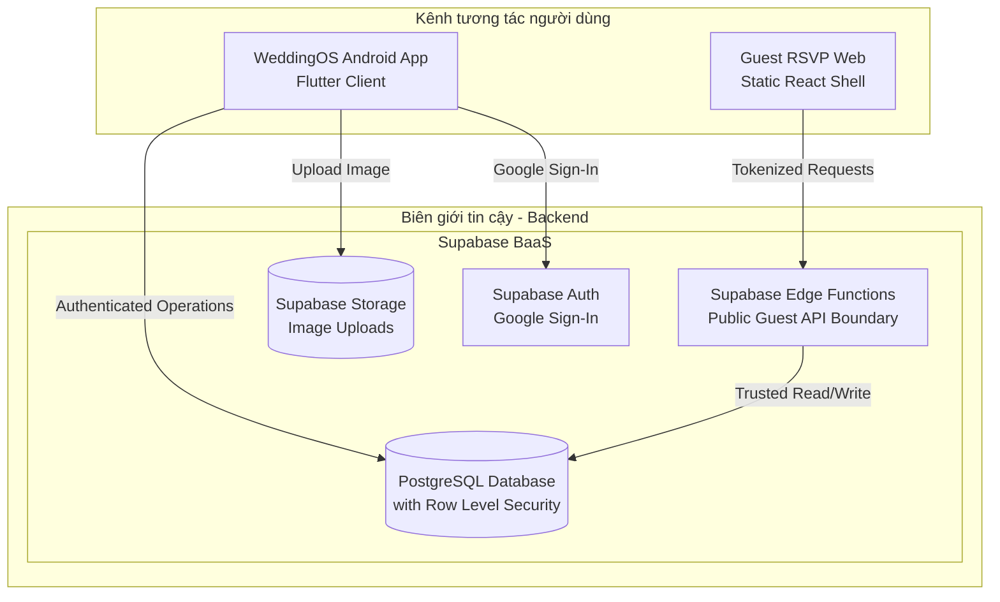

# Thiết Kế Kiến Trúc: Động Lực Kiến Trúc & Các Phương Án Lựa Chọn (Vòng 1)

Tài liệu này phân tích các Động lực Kiến trúc (Architecture Drivers), đánh giá các mô hình kiến trúc và so sánh các giải pháp công nghệ khả thi để đề xuất kiến trúc MVP cho hệ thống WeddingOS.

---

## 1. Ma Trận Động Lực Kiến Trúc (Architecture Driver Matrix)

Các yếu tố định hình kiến trúc được trích xuất từ tài liệu REQ-01 đến REQ-06:

| Mã động lực | Mô tả động lực | Nguồn gốc yêu cầu | Tác động Kiến trúc (Architectural Impact) | Mức độ ưu tiên | Rủi ro liên quan |
| :--- | :--- | :--- | :--- | :--- | :--- |
| **DRV-01** | Android-first Organizer | Ràng buộc Constraints / REQ-01 | Phải chọn công nghệ di động tối ưu trên Android. Khả năng tái sử dụng mã nguồn cho iOS trong tương lai là một lợi thế thiết kế dài hạn, không nằm trong phạm vi phát triển hiện tại của MVP. | **CRITICAL** | Lựa chọn framework không đáp ứng tốt giao diện phức tạp (form-heavy) và danh sách dài trên Android. |
| **DRV-02** | Guest-facing Web | Constraints / REQ-05 | Trang Web di động nhẹ, không yêu cầu tài khoản, truy cập bằng mã bảo mật cá nhân hóa, tối ưu tốc độ tải. | **CRITICAL** | Tốc độ load trang chậm trên mạng 4G làm giảm tỷ lệ phản hồi RSVP. |
| **DRV-03** | Free-tier-first Infrastructure | Constraints / REQ-06 | Lựa chọn hạ tầng tối thiểu chi phí cố định cho validation phase. Tuy nhiên, không hy sinh tính toàn vẹn dữ liệu (Data Integrity) và bảo mật để đạt chi phí $0$ đ. | **HIGH** | Dự án bị tạm ngừng hoạt động hoặc mất dữ liệu khi vượt hạn mức miễn phí. |
| **DRV-04** | Isolation & Tenant Privacy | REQ-06 | Cô lập dữ liệu tuyệt đối giữa các Đám cưới. Bảo vệ dữ liệu nhạy cảm (SĐT, RSVP, Tài chính) khỏi rò rỉ chéo. | **HIGH** | Lỗ hổng rò rỉ dữ liệu chéo từ tầng DB hoặc API. |
| **DRV-05** | Finance Calculation & Integrity | REQ-03 / REQ-06 | Đảm bảo tính toán ngân sách, nợ phải trả, thanh toán đợt và không tạo giao dịch trùng lặp khi retry. | **HIGH** | Ghi nhận trùng lặp giao dịch tài chính do mất kết nối hoặc timeout mạng. |
| **DRV-06** | Excel Import / Export | REQ-04 / REQ-06 | Xử lý tệp Excel nhập 300 dòng và xuất file kiểm chéo bản tối giản cho bố mẹ. | **MEDIUM** | Tràn bộ nhớ điện thoại (OOM) hoặc chạy tác vụ nặng làm treo ứng dụng. |

---

## 2. Bối Cảnh Hệ Thống & Kiến Trúc Logic (System Context & Logical Architecture)

Sơ đồ phân định biên giới tin cậy và bối cảnh logic hệ thống:

---

## 3. Bản Đồ Phân Định Quyền Hạn Máy Chủ (Server Authority Matrix)

Hệ thống thiết lập ranh giới tin cậy (Trusted Boundary) để kiểm soát các invariant nghiệp vụ nhạy cảm. Client-side chỉ có vai trò đề xuất thao tác (propose) và phục vụ trải nghiệm UX, máy chủ mới giữ quyền quyết định tối cao (authoritative):

*   **Simple CRUD & Authorized Reads:** Được phép gọi trực tiếp thông qua Supabase Data API dưới sự bảo vệ của chính sách PostgreSQL Row Level Security (RLS) để cô lập dữ liệu đám cưới giữa các tài khoản (ví dụ: đọc/ghi dữ liệu Tasks, Profiles đơn giản).
*   **Sensitive & Compound Operations:** Bắt buộc phải xử lý thông qua biên giới máy chủ/database tin cậy (Supabase Edge Functions hoặc DB Triggers/Stored Procedures).

| Lĩnh vực nghiệp vụ | Quyền hạn của Client (Android/Web) | Quyền hạn của Trusted Boundary (Server/DB) | Biện pháp kiểm soát (Enforcement) |
| :--- | :--- | :--- | :--- |
| **Thành viên Đám cưới** | Đề xuất thêm/xóa thành viên. | **Quyết định tối cao**. Kiểm tra quyền Owner trước khi cập nhật. | DB Constraint + Server-side Verification. |
| **Giao dịch Tài chính** | Gửi yêu cầu thanh toán/hoàn tiền kèm Client Mutation ID. | **Quyết định tối cao**. Thực hiện SQL Transaction để tính toán dòng tiền, ngăn chặn duplicate mutation khi mạng bị retry. | SQL Transaction + Idempotency check. |
| **Mã token thiệp mời** | Gửi yêu cầu sinh/tái tạo link thiệp. | **Quyết định tối cao**. Sinh mã token cá nhân hóa có độ hỗn loạn cao (high-entropy), thu hồi token cũ. | Serverless Edge Function. |
| **Hạn chót RSVP** | Đề xuất gửi RSVP. | **Quyết định tối cao**. Kiểm tra thời gian gửi so với mốc Cutoff Date của Đám cưới. | Serverless Edge Function (Wedding Timezone check). |
| **Phản hồi RSVP hiện tại** | Gửi thông tin RSVP. | **Quyết định tối cao**. Xác thực token, cập nhật đè (UPSERT) trên một bản ghi duy nhất. | SQL Schema Constraint + UPSERT logic. |
| **Confirm Guest Import** | Parse Excel thô hiển thị preview và gửi danh sách JSON đã chuẩn hóa. | **Quyết định tối cao**. Re-validate toàn bộ dữ liệu, kiểm tra trùng SĐT, tự tạo Group. Không tin cậy JSON từ client gửi lên. | Server-side validation. |
| **Xóa Sự kiện cưới** | Đề xuất xóa sự kiện. | **Quyết định tối cao**. Chuyển các task/budget liên kết về NONE, giữ nguyên RSVP lịch sử. | DB Cascading / Server-side batch update. |

---

## 4. Đánh Giá Mô Hình Backend: Monolith vs BaaS vs Hybrid

| Thuộc tính phân tích | Phương án A: Traditional Monolith | Phương án B: BaaS Dominant | Phương án C: Hybrid (BaaS + Edge Functions) - **RECOMMENDED** |
| :--- | :--- | :--- | :--- |
| **Độ phức tạp (Complexity)** | Trung bình (Tự dựng Server, routing, auth, CORS). | Rất thấp (Dùng client SDK kết nối trực tiếp DB). | Thấp (Dùng BaaS cho CRUD và Edge Functions cho API tin cậy). |
| **Hạ tầng miễn phí (Free-tier)** | Kém (Render/Railway tự ngủ sau 15p gây trễ Cold Start). | Rất tốt (Supabase/Firebase cung cấp gói miễn phí lớn). | Rất tốt (Kết hợp gói miễn phí của BaaS và Cloudflare/Vercel). |
| **Độ tin cậy tài chính** | Cao (Tự kiểm soát transaction trên server). | Trung bình (RLS bảo vệ bảng nhưng khó check logic nghiệp vụ sâu). | Cao (Đẩy giao dịch nhạy cảm qua Edge Functions xử lý an toàn). |
| **Rủi ro rò rỉ dữ liệu** | Trung bình (Tự viết auth check trên API). | Thấp (Bảo vệ bằng Row Level Security trực tiếp ở Postgres). | Thấp (RLS cho client và Edge Functions cho public guest). |

---

## 5. So Sánh Công Nghệ Di Động Android

Đánh giá dựa trên mục tiêu phát triển solo/nhóm nhỏ và các đặc thù của WeddingOS:

*   **Native Android (Kotlin):** Hiệu năng xuất sắc. Tuy nhiên tốn nhiều thời gian code boilerplate và không có khả năng tái sử dụng mã nguồn nếu sau này mở rộng lên iOS.
*   **React Native:** Tốt, nhưng FlatList hiển thị danh sách lớn (Khách mời 300 dòng, công việc) đòi hỏi tinh chỉnh hiệu năng phức tạp để tránh lag giật trên Android trung bình-yếu.
*   **Flutter (Dart) - **PROVISIONALLY APPROVED**:**
    *   *Đặc thù WeddingOS:* Giúp solo developer phát triển nhanh giao diện form-heavy và danh sách dài nhờ cơ chế vẽ widget mượt mà, thư viện Supabase SDK chính thức cực kỳ ổn định. Khả năng tái sử dụng mã nguồn cho iOS trong tương lai là một lợi thế thiết kế dài hạn, không nằm trong phạm vi bắt buộc của MVP.
    *   *Ràng buộc:* MVP chỉ đóng gói và phát hành ứng dụng trên nền tảng Android.

---

## 6. Khảo Sát Chi Tiết Hạ Tầng Miễn Phí (Free-tier Provider Analysis)

*Khảo sát số liệu thực tế từ tài liệu chính thức của nhà cung cấp vào ngày 20/08/2026:*

### A. Supabase Free Tier Limits
*   **Database (PostgreSQL):** Giới hạn **500MB** dung lượng lưu trữ.
*   **Object Storage (Ảnh thiệp cưới):** Giới hạn **1GB** dung lượng lưu trữ.
*   **Authentication:** Miễn phí **50.000 MAU** đối với đăng nhập Google OAuth và Email (Email MAU hạn định độc lập với khả năng chuyển phát thư tín của máy chủ SMTP).
*   **Băng thông truyền tải (Egress):** Miễn phí **5GB/tháng** (Bao gồm cả dữ liệu Database và Storage).
*   **Edge Functions:** Miễn phí **500.000 lượt gọi/tháng** (Tối đa 10 Edge Functions hoạt động).
*   **Ràng buộc tạm ngừng hoạt động (Inactivity Pausing):** Dự án sẽ tự động bị tạm dừng (pause) nếu không phát sinh bất kỳ tương tác ghi/đọc nào trong vòng **7 ngày liên tiếp**. Việc kích hoạt lại (resume) qua dashboard có thể mất từ 1 đến 3 phút.

### B. Cloudflare Pages Free Tier Limits (Thay thế Vercel Hobby để khởi chạy commercial validation)
*   **Băng thông truyền tải (Egress):** Các yêu cầu tải tài nguyên tĩnh (Static asset requests) là **hoàn toàn miễn phí và không giới hạn** dưới chính sách giá hiện tại của Cloudflare Pages.
*   **Build Quota:** Giới hạn **500 build/tháng**.
*   **Không bị ngủ (No Cold Starts):** Tài nguyên tĩnh được phân phối qua mạng lưới Edge CDN toàn cầu của Cloudflare. MVP không sử dụng Cloudflare Functions/Workers để xử lý business API (được chuyển giao hoàn toàn về Supabase Edge Functions).

---

## 7. Đánh Giá Rủi Ro Tạm Ngừng Dịch Vụ (Supabase Pause Risk Analysis)

*   **Mã rủi ro:** `FREE_PROJECT_PAUSE / GUEST_LINK_AVAILABILITY`
*   **Ngữ cảnh xảy ra:** Trong giai đoạn validation, nếu một đám cưới không phát sinh cập nhật dữ liệu trên ứng dụng Android trong 7 ngày liên tiếp $\rightarrow$ Supabase Database tự động bị pause.
*   **Tác động:** Khi khách mời mở link thiệp cưới cá nhân hóa, API Edge Function không thể kết nối tới Database $\rightarrow$ Giao diện Web hiển thị lỗi hệ thống, khách không thể xem thiệp và không thể RSVP.
*   **Mức độ nghiêm trọng:** **RẤT CAO** (Gây hỏng trải nghiệm khách mời, mất uy tín của sản phẩm).
*   **Chính sách nâng cấp khi chạy thực tế (Production Readiness Policy):**
    1.  *Giai đoạn phát triển / thử nghiệm nội bộ (Development/Internal Validation):* Chấp nhận rủi ro dự án tự ngủ. Không sử dụng các thủ thuật giữ thức (warmer) giả tạo để đánh lừa hệ thống.
    2.  *Giai đoạn Khởi chạy thực tế (Production Readiness Check):* Trước khi một Đám cưới thực tế gửi các liên kết thiệp mời tới khách mời, dự án bắt buộc phải trải qua bước kiểm tra sẵn sàng. Nếu yêu cầu về tính sẵn sàng và ổn định là tuyệt đối $\rightarrow$ **Upgrade Trigger** bắt buộc nâng cấp dự án lên gói trả phí của Supabase (gói **Pro Plan - $25/tháng** để tắt tính năng pause DB) nhằm đảm bảo hoạt động vĩnh viễn cho khách mời.

---

## 8. Ước Tính Băng Thông & Ảnh Hưởng Ảnh Thiệp (Media Egress Model)

Giả định quy mô validation: Đám cưới có **20.000 khách mời**. Công thức tính lưu lượng: `Egress = Số lượng khách mời × Số lần mở trang trung bình × Kích thước ảnh đại diện thiệp`.

*Lưu ý:* Phân tách rõ ràng giữa Băng thông đa phương tiện (`media egress`), Băng thông cơ sở dữ liệu/API (`API/database egress`), và Băng thông qua bộ nhớ đệm (`cached vs uncached egress`).

### Scenarios Băng thông tải Ảnh đại diện thiệp (Uncached Media Egress):

| Kích thước ảnh đại diện | Egress khi mở trang 1 lần/khách | Egress khi mở trang 2 lần/khách | Đánh giá Khả thi trên Gói Free Supabase (Hạn mức 5GB) |
| :--- | :--- | :--- | :--- |
| **100 KB** (Ảnh nén tối ưu) | $20.000 \times 1 \times 100KB \approx$ **2GB** | $20.000 \times 2 \times 100KB \approx$ **4GB** | 🟢 **Nằm trong hạn mức** (Dưới 5GB). |
| **250 KB** (Ảnh chất lượng vừa) | $20.000 \times 1 \times 250KB \approx$ **5GB** | $20.000 \times 2 \times 250KB \approx$ **10GB** | 🟡 **AMBER** (Nguy cơ vượt hạn mức nếu khách truy cập lại hoặc không cache). |
| **500 KB** (Ảnh chất lượng cao) | $20.000 \times 1 \times 500KB \approx$ **10GB** | $20.000 \times 2 \times 500KB \approx$ **20GB** | 🔴 **RED** (Chắc chắn vượt hạn mức, gây khóa băng thông). |

*Giải pháp giảm thiểu:* Điện thoại Android bắt buộc tự nén ảnh cưới trước khi up để hạn chế kích thước payload. Nếu quy mô tăng trưởng $\rightarrow$ Chuyển lưu trữ ảnh sang **Cloudflare R2** (miễn phí băng thông tải ảnh).

---

## 9. Phân Tích Mô Hình Chi Phí Giai Đoạn Validation (Validation Cost Model)

Ước tính cho quy mô validation ban đầu: 100 Đám cưới hoạt động cùng lúc (20.000 khách mời):

*   **GREEN (An toàn trong quota miễn phí):**
    *   *Database:* 100 Weddings $\times$ 3MB/wedding $\approx$ **300MB** (Dưới hạn mức 500MB).
    *   *Auth MAU:* 200 tài khoản ban tổ chức (Dưới hạn mức 50.000 MAU).
    *   *Storage:* 100MB ảnh đại diện thiệp (Dưới hạn mức 1GB).
    *   *Web Hosting:* Cloudflare Pages không giới hạn băng thông cho tài nguyên tĩnh.
    *   *Thông báo:* In-app Attention Center xử lý nội bộ không phát sinh phí.
*   **AMBER (Rủi ro vượt hạn mức/thiếu độ ổn định):**
    *   *Băng thông tải ảnh (Media Egress):* Dễ dàng vượt mốc 5GB nếu người dùng up ảnh đại diện nặng và không nén tốt (Cần kiểm soát dung lượng tải lên).
*   **RED (Yêu cầu nâng cấp / Trả phí):**
    *   *Email Magic Link:* Gói miễn phí Supabase chỉ cho phép gửi **2 email/giờ** thông qua máy chủ SMTP mặc định của họ $\rightarrow$ Không thể vận hành thực tế. MVP quyết định **chỉ sử dụng Google Sign-In** làm phương thức đăng nhập duy nhất cho ban tổ chức. Magic Link bị hoãn lại cho tới khi có cấu hình SMTP ngoài.

---

## 10. Kiến Trúc Trang Web Khách Mời & Bảo Mật RSVP

*   **Giao diện thiệp Web:** Sử dụng **Static React/Vite application shell + runtime personalized Invitation data**. Trang web tĩnh được deploy lên **Cloudflare Pages CDN** để đảm bảo tốc độ tải trang nhanh nhất. Khi tải trang, client JavaScript thực hiện gọi API nạp dữ liệu động từ máy chủ bảo mật.
*   **Biên giới API Tin cậy (Trusted API Boundary):** Khách vãng lai không có quyền truy cập trực tiếp vào các bảng dữ liệu PostgreSQL. Mọi tương tác đọc thiệp và gửi RSVP bắt buộc phải đi qua Supabase Edge Functions:
    *   *Đọc thiệp:* Guest Web gửi token $\rightarrow$ Edge Function xác thực token $\rightarrow$ Lọc và làm sạch dữ liệu PII (ẩn SĐT, email khách khác, ẩn tài chính) $\rightarrow$ Trả JSON sạch về Web.
    *   *Gửi RSVP:* Guest Web gửi dữ liệu RSVP $\rightarrow$ Edge Function thực hiện kiểm tra bảo mật (xác thực token, kiểm tra mốc Cutoff Date của đám cưới theo múi giờ đám cưới) $\rightarrow$ Lưu dữ liệu thông qua lệnh ghi được ủy quyền tin cậy.

---

## 11. Đánh Giá Khả Năng Khóa Nền Tảng (Platform Vendor Lock-in)

Đánh giá mức độ phụ thuộc công nghệ vào hệ sinh thái Supabase của MVP:

| Phân hệ | Mức độ Lock-in | Phân tích & Khả năng di chuyển (Migration Path) |
| :--- | :--- | :--- |
| **Database** | **Thấp** | PostgreSQL tiêu chuẩn. Dữ liệu dễ dàng xuất ra dưới dạng file SQL dump để import vào bất kỳ máy chủ Postgres nào khác. |
| **Authentication** | **Trung bình** | Supabase Auth sử dụng chuẩn JWT. Việc di chuyển danh tính sang Auth0 hoặc Firebase Auth đòi hỏi xuất và import bảng `auth.users` của hệ thống. |
| **Row Level Security** | **Thấp** | Các chính sách RLS được viết trực tiếp bằng SQL tiêu chuẩn trong DB PostgreSQL. |
| **Storage** | **Trung bình** | Các liên kết ảnh được lưu trữ dạng URL. Di chuyển sang S3/R2 đòi hỏi cập nhật lại các bản ghi URL trong DB. |
| **Edge Functions** | **Trung bình** | Viết bằng Deno/TypeScript. Có thể đóng gói lại thành các endpoint Node.js/Express chuẩn để deploy sang Docker. |

---

## 12. Phương Án Kiến Trúc Hệ Thống Chi Tiết

### PHƯƠNG ÁN A (Supabase + Cloudflare Pages Static Hosting) - **PROVISIONALLY APPROVED**

*   **Android App:** Phát triển bằng **Flutter** (chỉ đóng gói phát hành bản cài đặt Android cho MVP).
*   **Guest Web:** Giao diện **React/Vite SPA** deploy tĩnh trên **Cloudflare Pages** để có băng thông tải ảnh tĩnh miễn phí không giới hạn.
*   **Backend & DB:** Sử dụng **Supabase PostgreSQL** làm DB chính. Cô lập đám cưới bằng **Row Level Security (RLS)** trên DB. Các giao dịch tài chính nhạy cảm và xác thực RSVP của khách mời được xử lý an toàn thông qua **Supabase Edge Functions** (Biên giới API tin cậy).
*   **Xác thực:** **Google Sign-In** là phương thức đăng nhập duy nhất cho ban tổ chức trên Android để đảm bảo free-tier.
*   **Thông báo:** Sử dụng **In-app Attention Center** trong ứng dụng Android.

---

### PHƯƠNG ÁN B (Conventional Serverless - Node.js API + Neon Postgres)

*   **Android App:** Phát triển bằng **Flutter** (hoặc Native Kotlin).
*   **Guest Web:** Giao diện **Next.js SSR** deploy trên **Vercel** (Bắt buộc dùng gói **Vercel Pro - $20/tháng** vì lý do khởi chạy thương mại).
*   **Backend:** API server tự dựng bằng **Node.js** chạy trên các hàm serverless của Vercel.
*   **Database:** Sử dụng **Neon Serverless Postgres** làm DB lưu trữ chính.
*   **Auth & Storage:** Tích hợp dịch vụ xác thực và lưu trữ độc lập của **Firebase** (Free-tier).
*   *Đánh giá:* Phương án này đảm bảo tính độc lập và ít bị lock-in công nghệ nhất, tuy nhiên thời gian dựng API, cấu hình bảo mật và chi phí vận hành cố định ($20/tháng cho Vercel) cao hơn hẳn Phương án A.

---

## 13. Khảo Sát Tính Đồng Nhất Phân Hệ (Cross-module Consistency Review)

Kiến trúc kỹ thuật đề xuất đảm bảo đáp ứng đầy đủ các invariant và quy tắc chốt của toàn bộ các yêu cầu từ REQ-01 đến REQ-06:
*   **Một sự kiện chính hoạt động (Main Event Invariant):** DB Constraint trên Postgres chặn không cho phép xóa sự kiện chính cuối cùng của Đám cưới (REQ-01/02).
*   **Bảo toàn dữ liệu RSVP lịch sử khi xóa sự kiện (Event Removal):** Khi một sự kiện con bị xóa, Edge Function hoặc Database trigger sẽ tự động cập nhật trường `is_deleted = true` trên thực thể sự kiện và ẩn khỏi Web của khách, nhưng bản ghi `EventResponse` liên quan vẫn được bảo toàn nguyên vẹn trong cơ sở dữ liệu để ban tổ chức rà soát.

---

## 14. Bảng Tiêu Chỉ Nghiệm Thu Kiến Trúc Điển Hỏi (Acceptance Criteria)

*   **XCT-AC-001 (Revoked Member Redirection):**
    *   *Given:* Người dùng A bị xóa quyền truy cập tại Đám cưới X. Người dùng A còn tham gia Đám cưới Y.
    *   *When:* Người dùng A bấm cập nhật dữ liệu của Đám cưới X trên app.
    *   *Then:* Supabase Edge Function kiểm tra quyền, báo lỗi xác thực. App Android nhận mã lỗi RLS, lập tức hiển thị thông báo mất quyền và tự động chuyển hướng người dùng A về màn hình chọn Đám cưới (`Wedding Selector`) để xem Đám cưới Y.
*   **XCT-AC-002 (Wedding Context Switch Cache Clean):**
    *   *Given:* Người dùng chuyển đổi bối cảnh từ Đám cưới A sang Đám cưới B trên app.
    *   *When:* Màn hình đám cưới B tải xong.
    *   *Then:* Khách hàng không nhìn thấy bất kỳ dữ liệu cũ nào của Đám cưới A trên giao diện hiển thị.
*   **XCT-AC-003 (Timezone Aware RSVP Cutoff):**
    *   *Given:* Đám cưới cấu hình múi giờ `Asia/Ho_Chi_Minh`. Hạn chót RSVP là ngày `15/10/2026`. Khách truy cập từ Nhật Bản (UTC+9).
    *   *When:* Khách gửi RSVP vào lúc 23:30 ngày `15/10/2026` theo giờ Việt Nam.
    *   *Then:* API Edge Function kiểm tra múi giờ của đám cưới, chấp nhận ghi nhận phản hồi hợp lệ.
*   **XCT-AC-004 (Archived Wedding View-only):**
    *   *Given:* Đám cưới đã bị chuyển trạng thái lưu trữ (`Archived`).
    *   *When:* Một thành viên ban tổ chức mở app xem dữ liệu.
    *   *Then:* Ứng dụng hiển thị ở chế độ chỉ đọc. Mọi yêu cầu ghi sửa đổi gửi lên Supabase đều bị DB chặn bằng chính sách RLS.
*   **XCT-AC-005 (Archived Wedding Guest Link Access):**
    *   *Given:* Đám cưới X đã bị chuyển sang lưu trữ.
    *   *When:* Khách mở link thiệp cưới cá nhân hóa cũ.
    *   *Then:* API Edge Function kiểm tra trạng thái đám cưới, chặn truy cập và chuyển hướng khách sang trang báo lỗi an toàn **WEB-ERR-01** (không rò rỉ bất kỳ thông tin đám cưới nào).
*   **XCT-AC-006 (Network Retry Idempotency):**
    *   *Given:* Người dùng bấm lưu thanh toán đợt chi tiêu. Yêu cầu mạng timeout khiến ứng dụng tự động gửi lại (Retry).
    *   *When:* DB Transaction kiểm tra trùng khớp Client Mutation ID.
    *   *Then:* Chỉ có 1 bản ghi giao dịch thanh toán duy nhất được tạo ra trong DB.
*   **XCT-AC-007 (Confirm Guest Import Validation):**
    *   *Given:* Client Android gửi danh sách JSON khách mời đã chuẩn hóa lên server.
    *   *When:* Hệ thống xử lý nạp dữ liệu.
    *   *Then:* API Serverless Edge Function tự chạy lại trình re-validate dữ liệu (kiểm tra rỗng tên, kiểm tra trùng SĐT, tự tạo Group) trước khi ghi vào DB.
