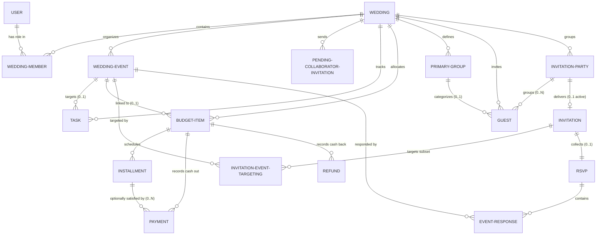

# Đặc Tả Kiến Trúc: 03 — Data Architecture (Kiến Trúc Dữ Liệu)

*   **Trạng thái (Status):** Approved (Đã Phê duyệt)
*   **Người thực hiện:** Antigravity (AI Architect)
*   **Ngày cập nhật:** 20/08/2026

---

## 1. Nguyên Tắc Thiết Kế Dữ Liệu (Data Architecture Principles)

Hệ thống WeddingOS thiết lập các nguyên tắc dữ liệu mức logic cốt lõi làm nền tảng cho việc lưu trữ:
1.  **Dữ liệu nguồn lịch sử tối thượng (Authoritative Source Facts):** Dữ liệu tài chính (giao dịch, số tiền đã chốt) và ngày chốt sự kiện thực tế là sự thật tối cao. Các giá trị phái sinh (báo cáo, nợ tồn đọng) phải được tính toán từ nguồn này để tránh mâu thuẫn dữ liệu.
2.  **Độc lập hạ tầng lưu trữ hình ảnh (Media Portability):** Không lưu trữ URL liên kết vật lý đầy đủ của nhà cung cấp Cloud Storage vào cơ sở dữ liệu. Chỉ lưu trữ đường dẫn logic (Object Reference) để bảo đảm khả năng di dời dữ liệu.
3.  **Không tạo dữ liệu ảo (No Fake Values):** Chặn việc sử dụng các mốc ngày giả (như ngày 15 giữa tháng) để đại diện cho tháng dự kiến (`Expected Month`). Expected Month phải được đối xử như một khái niệm nghiệp vụ độc lập bậc nhất.
4.  **Bảo toàn lịch sử tài chính và RSVP:** Tuyệt đối không tự động xóa cứng các bản ghi giao dịch tài chính hoặc dữ liệu phản hồi RSVP của khách mời khi cấu trúc sự kiện con bị dời đổi hoặc xóa bỏ.
5.  **Cô lập bối cảnh Đám cưới (Logical Tenant Ownership Path):** Mọi thực thể nghiệp vụ thuộc phạm vi đám cưới bắt buộc phải có một đường dẫn sở hữu logic rõ ràng để chứng minh bản ghi X thuộc về Đám cưới Y. Việc nhân bản cột `wedding_id` trực tiếp tại tất cả các bảng vật lý hay không được hoãn lại cho tầng Thiết kế vật lý / RLS quyết định.
6.  **Đầu vào client không đáng tin cậy:** Các giá trị tính toán phái sinh tuyệt đối không được chấp nhận trực tiếp từ client như một nguồn dữ liệu có thẩm quyền.

---

## 2. Thực Thể Dữ Liệu Logic (Logical Entities)

### A. Phân Hệ Lõi Đám Cưới (Wedding Core)
*   **`User` (Tài khoản người dùng):** Thực thể đại diện cho tài khoản xác thực bên ngoài (`auth.users`), định danh bằng `user_id` ổn định. Không thiết kế lại hay trùng lặp cấu trúc nội bộ của `auth.users`.
*   **`Wedding` (Đám cưới / Không gian làm việc):** Aggregate Root đại diện cho đám cưới.
    *   *Thuộc tính:* `wedding_id` (PK), `name` (tên đám cưới), `target_budget` (hạn mức ngân sách tiêu chí - nullable), `expected_month` (tháng cưới dự kiến - dạng chuỗi `YYYY-MM`), `exact_date` (ngày cưới chính xác - dạng Calendar Date `YYYY-MM-DD` - nullable), `cultural_context` (phong tục tổ chức: BẮC / TRUNG / NAM / TÙY_CHỌN), `rsvp_cutoff_date` (ngày chốt RSVP - nullable), `status` (ACTIVE / ARCHIVED / DELETED).
*   **`WeddingMember` (Thành viên đám cưới):** Liên kết giữa `User` và `Wedding`.
    *   *Thuộc tính:* `wedding_member_id` (PK), `wedding_id` (FK), `user_id` (FK - tham chiếu User identity), `role` (OWNER / COLLABORATOR), `status` (ACTIVE / REVOKED).
*   **`WeddingEvent` (Sự kiện cưới con):** Aggregate Root riêng biệt.
    *   *Thuộc tính:* `wedding_event_id` (PK), `wedding_id` (FK), `name` (tên lễ: Ăn hỏi, Thành hôn...), `exact_date` (ngày chốt - nullable), `start_time` (giờ bắt đầu địa phương - nullable), `location` (địa chỉ tổ chức - nullable), `map_link` (link chỉ đường Apple/Google Maps - nullable), `is_main_event` (sự kiện chính - boolean).
    *   *Trạng thái vòng đời:* Hỗ trợ khái niệm logic về trạng thái "đã xóa/ngưng hoạt động lịch sử" để bảo toàn quan hệ với RSVP cũ (đại diện vật lý cụ thể được hoãn lại).

*   **`PendingCollaboratorInvitation` (Lời mời Collaborator đang chờ):** 
    *   *Thuộc tính:* `invitation_id` (PK), `wedding_id` (FK), `invited_email` (email Google nhận mời), `role` (mặc định COLLABORATOR), `status` (PENDING / ACCEPTED / REVOKED), `created_at` (ngày tạo), `accepted_user_id` (FK tới `User` sau khi claim).

### B. Phân Hệ Kế Hoạch (Planning)
*   **`Task` (Công việc phẳng):** Aggregate Root quản lý đầu việc.
    *   *Thuộc tính:* `task_id` (PK), `wedding_id` (FK), `wedding_event_id` (FK - nullable, liên kết tối đa 1 sự kiện), `assignee_id` (FK tới `WeddingMember` - nullable), `name` (tên việc), `status` (TODO / IN_PROGRESS / COMPLETED / CANCELLED), `deadline_intent` (ý định hạn chót: SYSTEM_RELATIVE / USER_RELATIVE / USER_ABSOLUTE / NO_DEADLINE), `date_offset` (số ngày lệch so với ngày sự kiện cưới con, số nguyên có dấu), `custom_override_date` (ngày dương lịch chốt cứng do người dùng ghi đè), `task_source` (SYSTEM / USER), `completed_at` (thời điểm hoàn thành).
    *   *Hạn chót lịch sử:* Khi công việc chuyển sang `COMPLETED`, hạn chót dương lịch đã giải quyết tại thời điểm hoàn thành bắt buộc phải được bảo toàn lịch sử. Các thay đổi ngày sự kiện sau đó không được phép viết đè lên giá trị này. Thiết kế lưu vết (candidate physical representation) được quyết định ở phase tiếp theo.

### C. Phân Hệ Tài Tài Chính (Finance)
*   **`BudgetItem` (Khoản mục chi tiêu):** Aggregate Root của phân hệ tài chính.
    *   *Thuộc tính:* `budget_item_id` (PK), `wedding_id` (FK), `wedding_event_id` (FK - nullable, liên kết sự kiện cưới con hoặc null nếu là chi phí chung đám cưới), `responsible_member_id` (FK tới `WeddingMember` - nullable), `name` (tên khoản chi), `estimated_cost` (dự toán ban đầu - nullable), `confirmed_cost` (giá trị thực tế đã chốt - nullable), `side` (Cost Side: COMMON / BRIDE_SIDE / GROOM_SIDE).
*   **`Installment` (Đợt thanh toán nội bộ):** Thuộc về `BudgetItem`.
    *   *Thuộc tính:* `installment_id` (PK), `budget_item_id` (FK), `amount` (số tiền đợt trả - số thực dương), `due_date` (hạn thanh toán), `status` (PENDING / PAID).
*   **`Payment` (Giao dịch chi ra thực tế):** Lịch sử dòng tiền ra của `BudgetItem`.
    *   *Thuộc tính:* `payment_id` (PK), `budget_item_id` (FK), `installment_id` (FK - nullable, giao dịch có thể liên kết thỏa mãn một đợt thanh toán cụ thể), `amount` (số tiền chuyển - số thực dương), `payment_date` (ngày chuyển), `payer` (phân loại người trả thực tế: BRIDE / GROOM / BRIDE_PARENTS / GROOM_PARENTS / OTHER), `notes` (ghi chú giao dịch).
*   **`Refund` (Giao dịch hoàn tiền nhận về):** Dòng tiền vào hoàn lại của `BudgetItem`.
    *   *Thuộc tính:* `refund_id` (PK), `budget_item_id` (FK), `amount` (số tiền nhận lại - số thực dương, không lưu âm để tránh mâu thuẫn REQ-03), `refund_date` (ngày hoàn), `receiver` (người nhận lại), `notes` (ghi chú hoàn tiền).

### D. Phân Hệ Khách Mời (Guest Management)
*   **`PrimaryGroup` (Nhóm mối quan hệ):** Thực thể quản lý nhóm do người dùng tự định nghĩa.
    *   *Thuộc tính:* `primary_group_id` (PK), `wedding_id` (FK), `name` (tên nhóm: Bạn cấp 3, Đồng nghiệp...).
*   **`Guest` (Hồ sơ khách mời lẻ):** Aggregate Root độc lập.
    *   *Thuộc tính:* `guest_id` (PK), `wedding_id` (FK), `invitation_party_id` (FK - nullable, khách có thể chưa được phân vào nhóm mời), `primary_group_id` (FK - nullable, liên kết tối đa một nhóm quan hệ), `name` (tên khách), `phone` (số điện thoại - nullable), `email` (email - nullable), `side` (BRIDE_SIDE / GROOM_SIDE / COMMON), `guest_source` (nguồn: BRIDE / GROOM / BRIDE_PARENTS / GROOM_PARENTS / OTHER).
*   **`InvitationParty` (Nhóm mời / Hộ gia đình):** Aggregate Root độc lập.
    *   *Thuộc tính:* `invitation_party_id` (PK), `wedding_id` (FK), `display_name` (tên hiển thị thiệp, ví dụ: "Anh Nam và Bạn"), `invited_count` (số người được mời tối đa - số nguyên không âm `invited_count >= 0`).

### E. Phân Hệ Lời Mời & RSVP (Invitation & RSVP)
*   **`Invitation` (Tấm thiệp mời trực tuyến):** Aggregate Root cho biên công khai.
    *   *Thuộc tính:* `invitation_id` (PK), `wedding_id` (FK), `invitation_party_id` (FK - liên kết tới nhóm mời), `access_token` (token ngẫu nhiên entropy cao phục vụ link `/invite/{token}`), `status` (DRAFT / SENT / READ / REVOKED), `sent_at` (thời điểm gửi), `first_viewed_at` (mốc xem đầu), `last_viewed_at` (mốc xem cuối).
*   **`InvitationEventTargeting` (Nhắm mục tiêu sự kiện của thiệp):** Quan hệ nhiều-nhiều logic giữa thiệp và sự kiện được mời.
    *   *Thuộc tính:* `invitation_id` (FK), `wedding_event_id` (FK).
*   **`RSVP` (Phản hồi tổng hợp):** Nằm trong `Invitation`.
    *   *Thuộc tính:* `rsvp_id` (PK), `invitation_id` (FK), `submitted_at` (ngày gửi phản hồi), `notes` (lời chúc của khách).
*   **`EventResponse` (Phản hồi chi tiết theo sự kiện con):** Nằm trong `RSVP`.
    *   *Thuộc tính:* `event_response_id` (PK), `rsvp_id` (FK), `wedding_event_id` (FK), `is_attending` (đồng ý tham gia: TRUE / FALSE), `attending_count` (số người đi cùng thực tế: `attending_count >= 1` khi `is_attending == TRUE`, và `attending_count == 0` khi `is_attending == FALSE`).

---

## 3. Sơ Đồ Thiết Kế ERD Logic (Logical ERD)

Dưới đây là sơ đồ quan hệ logic chuẩn hóa, hiển thị đầy đủ mối quan hệ targeting nhiều-nhiều và thực thể PrimaryGroup:

---

## 4. Ánh Xạ Ranh Giới Hợp Nhất (Aggregate Mapping)

| Aggregate Root | Các Thực thể thuộc tính nội bộ (Internal Entities) | Ràng buộc tính nhất quán tức thời (Atomic Integrity) |
| :--- | :--- | :--- |
| **`Wedding`** | Không | Quản lý cấu hình chung đám cưới độc lập. |
| **`WeddingEvent`**| Không | Quản lý vòng đời sự kiện (MAIN_EVENT invariant). |
| **`WeddingMember`**| Không | Đảm bảo tính duy nhất của liên kết `User` $\leftrightarrow$ `Wedding`. |
| **`Task`** | Không | Lưu trạng thái, phân công và tính toán deadline. |
| **`BudgetItem`** | `Installment`, `Payment`, `Refund` | Tính toán công nợ và dòng tiền thực tế luôn khớp với Confirmed Cost. |
| **`PrimaryGroup`**| Không | Đảm bảo cô lập nhóm quan hệ tự định nghĩa theo từng đám cưới. |
| **`Guest`** | Không | Cho phép gộp/tách, di chuyển khách độc lập với cấu trúc Invitation. |
| **`InvitationParty`**| Danh sách tham chiếu `Guest` | Quản lý hạn mức mời (`Invited Count`) và tên hiển thị nhóm. |
| **`Invitation`** | `RSVP`, `EventResponse`, `InvitationEventTargeting` | Đảm bảo việc khách RSVP không gây tranh chấp khóa trên Guest. |

---

## 5. Ma Trận Quan Hệ & Bản Số (Relationship/Cardinality Matrix)

| Thực thể A | Thực thể B | Bản số (Cardinality) | Ý nghĩa nghiệp vụ |
| :--- | :--- | :--- | :--- |
| **`Wedding`** | **`WeddingEvent`** | $1 \rightarrow 1..N$ | Một đám cưới phải có ít nhất 1 sự kiện cưới (mặc định Lễ chính). |
| **`Wedding`** | **`WeddingMember`** | $1 \rightarrow 1..N$ | Đám cưới phải có ít nhất 1 thành viên (mặc định OWNER). |
| **`Wedding`** | **`Task`** | $1 \rightarrow 0..N$ | Đám cưới chứa danh sách các đầu việc lập kế hoạch. |
| **`WeddingEvent`**| **`Task`** | $1 \rightarrow 0..N$ | Một sự kiện con liên kết tới nhiều Task (nullable). |
| **`BudgetItem`** | **`Installment`** | $1 \rightarrow 0..N$ | Một khoản chi có thể chia làm nhiều đợt thanh toán. |
| **`BudgetItem`** | **`Payment`** | $1 \rightarrow 0..N$ | Một khoản chi ghi nhận nhiều giao dịch chuyển khoản ra. |
| **`Installment`** | **`Payment`** | $1 \rightarrow 0..N$ | Một đợt thanh toán có thể được chi trả bởi nhiều giao dịch (hoặc không). |
| **`InvitationParty`**| **`Guest`** | $1 \rightarrow 0..N$ | Hộ nhóm mời chứa danh sách thành viên thực tế (có thể rỗng). |
| **`InvitationParty`**| **`Invitation`** | $1 \rightarrow 0..1$ (active) | Hộ nhóm mời có tối đa một lời mời hoạt động trong MVP. |
| **`Invitation`** | **`InvitationEventTargeting`** | $1 \rightarrow 1..N$ | Tấm thiệp nhắm mục tiêu một hoặc nhiều sự kiện cưới. |
| **`Invitation`** | **`RSVP`** | $1 \rightarrow 0..1$ | Tấm thiệp thu nhận tối đa 1 phản hồi tham dự tổng hợp. |
| **`RSVP`** | **`EventResponse`**| $1 \rightarrow 1..N$ | Phản hồi chứa chi tiết câu trả lời cho từng sự kiện được mời. |
| **`WeddingEvent`**| **`EventResponse`**| $1 \rightarrow 0..N$ | Sự kiện cưới được phản hồi bởi nhiều khách mời trên Web. |

---

## 6. Ma Trận Dữ Liệu Nguồn & Phái Sinh (Source Fact / Derived Matrix)

| Khái niệm Dữ liệu | Dữ liệu nguồn? | Dữ liệu phái sinh? | Lịch sử? | Khả biến (Mutable)? | Cơ chế tính toán nghiệp vụ (Calculation Strategy) |
| :--- | :---: | :---: | :---: | :---: | :--- |
| **Wedding Date** | Có | Không | Không | Có | Lưu trực tiếp ngày dương lịch chốt cưới. |
| **Task Status** | Có | Không | Không | Có | Lưu trực tiếp trạng thái TODO / COMPLETED... |
| **Task Deadline** | Không | Có | Không | Có | SYSTEM_RELATIVE/USER_RELATIVE tính toán động theo ngày sự kiện liên kết. USER_ABSOLUTE lấy `custom_override_date`. |
| **Overdue (Trễ hạn)**| Không | Có | Không | Có | Tính toán động tại thời điểm mở app (read-time): `Current Date > Task Deadline` và `Status != COMPLETED`. |
| **Estimated Cost**| Có | Không | Không | Có | Giá trị ngân sách ước tính ban đầu (nhập tay). |
| **Confirmed Cost**| Có | Không | Không | Có | Giá trị chi phí nghĩa vụ thực tế đã chốt (nhập tay). |
| **Payment / Refund**| Có | Không | Có | Có | Bản ghi lịch sử dòng tiền. Khả năng sửa đổi sai sót được thiết kế tại Open Questions. |
| **Net Paid (Thanh toán ròng)**| Không | Có | Không | Có | Tính toán động: `SUM(Payment.amount) - SUM(Refund.amount)` (Refund và Payment đều lưu số dương). |
| **Outstanding (Cộng nợ)**| Không | Có | Không | Có | Tính toán động: `Confirmed Cost - Net Paid` (Chỉ tính khi có Confirmed Cost). |
| **Overpaid (Trả thừa)**| Không | Có | Không | Có | Tính toán động: `Net Paid - Confirmed Cost` (Khi Net Paid > Confirmed Cost). |
| **Projected Cost** | Không | Có | Không | Có | Tính toán động: `COALESCE(Confirmed Cost, Estimated Cost)`. |
| **Invited Count** | Có | Không | Không | Có | Lưu trữ hạn mức số người mời của Party. |
| **Attending Count**| Có | Không | Không | Có | Lấy trực tiếp từ phản hồi RSVP của khách trên Web. |
| **RSVP Summary** | Không | Có | Không | Có | Tính toán động: Tập hợp số khách tham gia các sự kiện để hiện Dashboard. |
| **Payment Schedule Needs Review**| Không | Có | Không | Có | Tính toán động: Phát hiện khi `Confirmed Cost != SUM(Installment.amount)` của khoản chi. |

---

## 7. Đường Dẫn Sở Hữu Tenant (Logical Tenant Ownership Path)

Hệ thống bảo đảm mọi thực thể đều có đường dẫn logic dẫn tới duy nhất một không gian Đám cưới (`Wedding`) để phục vụ cô lập dữ liệu. Việc nhân bản cột `wedding_id` trực tiếp tại tất cả các bảng vật lý để tối ưu hóa hiệu năng truy vấn RLS hay không sẽ được quyết định ở phase Thiết kế Cơ sở dữ liệu Vật lý.

*   `Wedding` $\rightarrow$ Độc lập (`wedding_id`).
*   `WeddingMember` $\rightarrow$ `Wedding` (`wedding_id`).
*   `WeddingEvent` $\rightarrow$ `Wedding` (`wedding_id`).
*   `PendingCollaboratorInvitation` $\rightarrow$ `Wedding` (`wedding_id`).
*   `Task` $\rightarrow$ `Wedding` (`wedding_id`).
*   `BudgetItem` $\rightarrow$ `Wedding` (`wedding_id`).
*   `Installment` $\rightarrow$ `BudgetItem` $\rightarrow$ `Wedding` (`wedding_id`).
*   `Payment` $\rightarrow$ `BudgetItem` $\rightarrow$ `Wedding` (`wedding_id`).
*   `Refund` $\rightarrow$ `BudgetItem` $\rightarrow$ `Wedding` (`wedding_id`).
*   `PrimaryGroup` $\rightarrow$ `Wedding` (`wedding_id`).
*   `Guest` $\rightarrow$ `Wedding` (`wedding_id`).
*   `InvitationParty` $\rightarrow$ `Wedding` (`wedding_id`).
*   `Invitation` $\rightarrow$ `Wedding` (`wedding_id`).
*   `InvitationEventTargeting` $\rightarrow$ `Invitation` $\rightarrow$ `Wedding` (`wedding_id`).
*   `RSVP` $\rightarrow$ `Invitation` $\rightarrow$ `Wedding` (`wedding_id`).
*   `EventResponse` $\rightarrow$ `RSVP` $\rightarrow$ `Invitation` $\rightarrow$ `Wedding` (`wedding_id`).

---

## 8. Ma Trận Vòng Đời Dữ Liệu (Lifecycle Matrix)

*   **Xóa sự kiện con (Class C Impact Operation):**
    *   Sự kiện cũ được chuyển trạng thái "đóng băng lịch sử/removed" (lifecycle supports an inactive/removed historical state).
    *   Các công việc mẫu của hệ thống chưa bị sửa: $\rightarrow$ Đề xuất xóa trong Impact Review.
    *   Các công việc do người dùng tạo hoặc đã chỉnh sửa: $\rightarrow$ Giữ lại và chuyển về cấp đám cưới.
    *   Các công việc đã hoàn thành: $\rightarrow$ Giữ lại hạn chót lịch sử và chuyển về cấp đám cưới.
    *   Các khoản chi tài chính và lịch sử giao dịch: $\rightarrow$ Giữ nguyên vẹn, ngắt liên kết sự kiện chuyển về cấp đám cưới.
    *   Phản hồi RSVP cũ: $\rightarrow$ Không cascade delete, giữ nguyên để ban tổ chức đối soát lịch sử.
*   **Xóa nhóm mối quan hệ PrimaryGroup:** 
    *   Cần xác nhận từ người dùng qua luồng logic nghiệp vụ (Class C).
    *   Toàn bộ khách thuộc nhóm cũ được giữ lại, liên kết nhóm mối quan hệ được loại bỏ (không quy giản thành luật cascade vật lý SET NULL đơn thuần ở mức logic).

---

## 9. Định Nghĩa Kiểu Dữ Liệu Logic (Date/Time Semantics)

*   **Expected Month (Tháng dự kiến):** Lưu trữ định dạng chuỗi ISO-8601 năm-tháng (`YYYY-MM`), không thay thế bằng ngày 15 giữa tháng để tránh hiển thị sai lệch múi giờ.
*   **Exact Date (Ngày chốt cưới):** Lưu trữ định dạng **Calendar Date** (`YYYY-MM-DD`), không đính kèm thông tin giờ giấc hay múi giờ.
*   **Local Event Time (Giờ sự kiện con):** Lưu trữ dạng chuỗi giờ phút địa phương tĩnh (ví dụ: `"09:30"`).
*   **Wedding Timezone (Múi giờ đám cưới):** Lưu tên múi giờ chuẩn IANA (mặc định là `"Asia/Ho_Chi_Minh"`), dùng để làm mốc tính toán hạn chót RSVP và deadline trễ hạn trên server.
*   **Absolute Due Date (Hạn chót cố định):** Lưu dạng Calendar Date (`YYYY-MM-DD`).
*   **Relative Offset (Lệch tương đối):** Số nguyên có dấu (Signed Integer), thể hiện số ngày dịch chuyển trước (-) hoặc sau (+) ngày cưới chính xác.
*   **Historical Timestamp (Mốc lịch sử):** Lưu dạng thời gian tuyệt đối toàn cầu kèm múi giờ (UTC Timestamp).

---

## 10. Xử Lý Giá Trị Rỗng / Chưa Biết (Null / Unknown Semantics)

*   `target_budget == NULL`: Cặp đôi chưa thiết lập mục tiêu ngân sách (Giao diện hiển thị gợi ý cấu hình, không hiển thị mặc định $0$).
*   `confirmed_cost == NULL`: Khoản chi tiêu chưa chốt giá trị thực tế với nhà cung cấp. Outstanding không được phép tính toán dựa trên Estimated Cost.
*   `exact_date == NULL` (ở cấp Wedding): Đám cưới chưa chốt ngày chính thức. Block tính năng RSVP của khách mời.
*   `wedding_event_id == NULL`: Đầu việc hoặc khoản chi phí chung cho cả đám cưới, không phân bổ riêng lẻ cho nghi lễ con nào.

---

## 11. Các Quy Tắc Ràng Buộc Nghiệp Vụ Cố Định (Integrity Invariants)

| Mã Quy tắc | Nội dung quy tắc ràng buộc nghiệp vụ | Ranh giới thực thi kỹ thuật tối ưu (Enforcement Boundary) |
| :--- | :--- | :--- |
| **INV-CORE-01** | Đám cưới bắt buộc phải có ít nhất một thành viên giữ vai trò `OWNER`. | **Database Trigger / Constraint** (Ngăn chặn xóa thành viên OWNER cuối cùng). |
| **INV-CORE-02** | Đám cưới bắt buộc phải giữ lại tối thiểu một Sự kiện chính (Main Event). Sự kiện chính cuối cùng không thể bị xóa hoặc thay đổi trạng thái cho đến khi một sự kiện khác được chọn/khởi tạo làm sự kiện chính. | **Class C Trusted Business Operation** (Chặn từ biên xử lý nghiệp vụ). |
| **INV-FIN-04** | Giá trị giao dịch thanh toán (`Payment.amount`) bắt buộc phải là số thực dương ($> 0$). | **Database CHECK Constraint** (`amount > 0`). |
| **INV-FIN-05** | Giá trị giao dịch hoàn tiền (`Refund.amount`) bắt buộc phải là số thực dương ($> 0$). | **Database CHECK Constraint** (`amount > 0`). |
| **INV-GUEST-07**| Mỗi khách mời (`Guest`) thuộc tối đa một `InvitationParty` hoạt động trong một đám cưới. | **Database Foreign Key & Unique Constraint** |
| **INV-GUEST-08**| Hạn mức mời (`Invited Count`) của một nhóm mời bắt buộc phải là số nguyên không âm ($\ge 0$). | **Database CHECK Constraint** (`invited_count >= 0`). |
| **INV-GUEST-09**| Số lượng khách xác nhận đi thực tế (`Attending Count`) trong phản hồi RSVP không được là số âm. | **Database CHECK Constraint** (`attending_count >= 0`). |
| **INV-MEMBER-01**| Không tồn tại hai lời mời collaborator đang chờ (`Pending Collaborator Invitation`) trùng email cho cùng một đám cưới. | **Database Unique Index** lọc theo điều kiện `status = 'PENDING'`. |

---

## 12. Sổ Nhật Ký Xung Đột Dữ Liệu Nghiệp Vụ (Data Architecture Conflict Register)

Dưới đây là danh sách các xung đột kiến trúc dữ liệu phát hiện và phương án xử lý chốt hạ:

### **`DATA-CONFLICT-001` (Refund Sign Model)**
*   *Xung đột:* Dự thảo trước đây mô tả hoàn tiền lưu giá trị âm (`Refund.amount < 0`). Điều này xung đột trực tiếp với đặc tả yêu cầu tài chính `REQ-03` quy định hoàn tiền là giao dịch tiền mặt dương độc lập.
*   *Giải quyết:* Chốt hạ mô hình dữ liệu lưu trữ giá trị hoàn tiền là số dương (`Refund.amount > 0`). Công thức tính toán tổng thanh toán ròng: `Net Paid = SUM(Payment) - SUM(Refund)`.

### **`DATA-CONFLICT-002` (Event Removal Cascade Semantics)**
*   *Xung đột:* Thiết kế trước đây tự động set NULL hoặc cascade delete khi xóa sự kiện cưới con. Điều này vi phạm nghiêm trọng tính toàn vẹn dữ liệu tài chính lịch sử và RSVP của khách mời.
*   *Giải quyết:* Chuyển luồng xóa sự kiện thành một **Giao dịch Nghiệp vụ Tin cậy Class C (Impact Operation)**. Sự kiện bị xóa chuyển trạng thái lịch sử không hoạt động, giữ lại các Task đã hoàn thành/đã sửa tay và chuyển về cấp đám cưới, bảo toàn toàn bộ BudgetItem và các EventResponse lịch sử của khách.

### **`DATA-CONFLICT-003` (Task Deadline Intent Model)**
*   *Xung đột:* Mô hình cũ gộp chung hạn chót tương đối của hệ thống và hạn tương đối do người dùng chỉnh sửa vào cùng một kiểu, khiến hệ thống không thể phân biệt khi chạy luồng tự động dời lịch sự kiện.
*   *Giải quyết:* Phân tách rõ ràng 4 ý định hạn chót: `SYSTEM_RELATIVE` (dịch chuyển tự động theo ngày sự kiện), `USER_RELATIVE` (dịch chuyển tự động nhưng bảo toàn khoảng cách tùy chỉnh), `USER_ABSOLUTE` (không dịch chuyển, chốt ngày dương lịch), và `NO_DEADLINE`.

---

## 13. Các Câu Hỏi Mở Nghiệp Vụ Cần Quyết Định (Open Questions)

### **`OPEN-DATA-001` (Financial Transaction Correction Semantics)**
*   *Nội dung:* Khi người tổ chức nhập sai thông tin giao dịch (`Payment` hoặc `Refund`), hệ thống nên áp dụng cơ chế sửa đổi dữ liệu nào để sửa đổi số lượng tiền hoặc thông tin?
*   *Phương án cân nhắc:* (1) Cho phép chỉnh sửa trực tiếp dưới bộ luật kiểm soát nghiêm ngặt; (2) Thực hiện hủy/vô hiệu hóa giao dịch cũ và tạo lập giao dịch thay thế; (3) Nhập một giao dịch điều chỉnh dòng tiền (Adjustment transaction).
*   *Trạng thái:* **Hoãn quyết định (Deferred Product Decision)** trước khi thực thi Thiết kế Cơ sở dữ liệu Vật lý và đặc tả API chi tiết cho phân hệ Tài chính. Câu hỏi này không ngăn cản việc phê duyệt Logical & Data Architecture.
