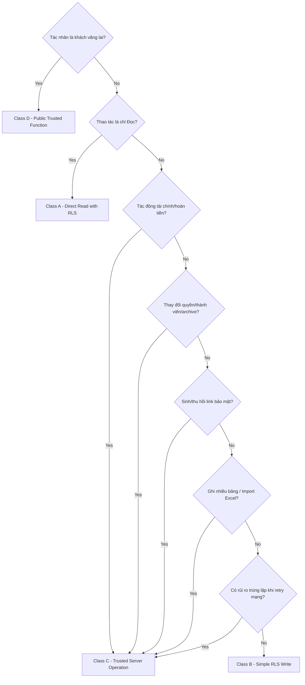

# Quyết Định Kiến Trúc: ADR-003 — Trust Boundary, Authorization & RLS

*   **Mã quyết định (ADR ID):** ADR-003
*   **Trạng thái (Status):** Approved (Đã Phê duyệt)
*   **Người thực hiện:** Antigravity (AI Architect)
*   **Ngày cập nhật:** 20/08/2026

---

## 1. Mục Tiêu (Purpose)
Quyết định này đặc tả ranh giới tin cậy (Trust Boundary) và mô hình phân quyền cho hệ thống WeddingOS:
*   Phân định các tác nhân tin cậy (trusted actors) và tác nhân không tin cậy (untrusted actors).
*   Xác định ranh giới quyết định tối cao về dữ liệu (authoritative boundaries).
*   Thiết lập các nguyên tắc thực thi vai trò (`OWNER` và `COLLABORATOR`).
*   Quy định giải pháp cô lập dữ liệu đám cưới chéo (`Wedding tenant isolation`).
*   Phân loại thao tác: Khi nào cho phép Android Client gọi trực tiếp qua Supabase Data API + RLS và khi nào bắt buộc phải thông qua môi trường máy chủ tin cậy.
*   Quy định cơ chế tách biệt tuyệt đối giữa truy cập Guest Web công khai và dữ liệu nghiệp vụ của ban tổ chức.

Tài liệu này **KHÔNG** định nghĩa chi tiết cấu trúc bảng cụ thể, mã SQL RLS, API contract, hoặc mã nguồn triển khai.

---

## 2. Các Phân Vùng Tin Cậy (Actor Trust Zones)

Hệ thống phân chia thành các phân vùng tin cậy với mức độ kiểm soát tăng dần:

### A. Organizer Flutter Client (Ứng dụng Android của cặp đôi)
*   *Mức độ tin cậy:* **Không tin cậy (Untrusted)**. 
*   *Bản chất:* Chạy trên thiết bị di động của người dùng (nằm ngoài vùng kiểm soát vật lý của máy chủ). Có thể bị dịch ngược mã nguồn hoặc bị can thiệp bộ nhớ. Thiết bị chỉ giữ session token của người dùng. Ứng dụng tuyệt đối không được tin cậy hoàn toàn chỉ vì đó là client Android chính thức.

### B. Guest Web (Trình duyệt của khách mời)
*   *Mức độ tin cậy:* **Không tin cậy (Untrusted)**.
*   *Bản chất:* Chạy trên trình duyệt di động công khai của khách vãng lai, không có tài khoản tổ chức, chỉ sở hữu duy nhất mã bảo mật liên kết thiệp mời (`Invitation credential`).

### C. Supabase Data API (Cổng CRUD trực tiếp của Client)
*   *Mức độ tin cậy:* **Ranh giới ủy quyền của cơ sở dữ liệu (Database Authorization Boundary)**.
*   *Bản chất:* Cổng tự động sinh của Supabase cho phép Client Android đọc/ghi trực tiếp vào database. Quyền truy cập trực tiếp của organizer được quyết định và kiểm soát chặt chẽ bởi sự kết hợp của: **Postgres Grants + RLS + danh sách thành viên đám cưới tối cao (authoritative Wedding membership)**. Sự hiển thị trên Flutter UI chỉ phục vụ trải nghiệm người dùng, hoàn toàn không có giá trị phân quyền bảo mật. Privileged credentials tuyệt đối không được để lộ cho Flutter client.

### D. Trusted / Privileged Execution Boundary (Ranh Giới Thực Thi Đặc Quyền Tin Cậy)
*   *Mức độ tin cậy:* **Tin cậy đặc quyền (Trusted / Privileged)**.
*   *Bản chất:* Môi trường thực thi server-side (Supabase Edge Functions và/hoặc các stored procedures chạy dưới quyền hệ thống). Mặc dù nằm ở phía máy chủ tin cậy, logic nghiệp vụ chạy tại đây vẫn **BẮT BUỘC** phải xác thực danh tính tác nhân (actor identity), tư cách thành viên đám cưới (Wedding membership), vai trò (role), bối cảnh đám cưới yêu cầu (requested Wedding context), và kiểm tra các ràng buộc nghiệp vụ. Một Edge Function không tự động có quyền thực hiện mọi thứ chỉ vì nó chạy trên server. Khi các tài khoản đặc quyền (service-role credentials) được sử dụng để bypass RLS, cơ chế xác thực quyền tường minh (explicit authorization) là bắt buộc.

### E. PostgreSQL Database (Cơ sở dữ liệu tối cao)
*   *Mức độ tin cậy:* **Nguồn Sự Thật Tối Cao (Authoritative Persistence)**.
*   *Bản chất:* Nơi lưu trữ và áp dụng các ràng buộc dữ liệu cứng (CHECK, FOREIGN KEY, Unique) và thực thi RLS chặng cuối.

---

## 3. Nguyên Tắc Bảo Mật Cốt Lõi (Core Security Principle)
*   **Quy tắc tối cao:** Không bao giờ tin tưởng các tham số do Client tự tính toán hoặc tự khai báo gửi lên đối với dữ liệu nhạy cảm hoặc logic nghiệp vụ.
*   *Cụ thể:* Máy chủ/Database **phải tự kiểm tra và xác thực lại**, không chấp nhận dữ liệu client tự truyền trực tiếp các giá trị như: ID Đám cưới hoạt động (`wedding_id`), Vai trò người dùng (`role`), Tổng tiền tích lũy tài chính, Kết quả kiểm tra quá hạn RSVP (`RSVP cutoff`), Kết quả kiểm tra trùng lặp, Số tiền Outstanding/Overpaid của chi tiêu, hay Quyền sở hữu mã thiệp mời.
*   *Hành vi:* Client chỉ được phép đề xuất thay đổi (propose). Hệ thống máy chủ tin cậy quyết định sự hợp lệ của giao dịch ghi.

---

## 4. Cô Lập Đám Cưới Chéo (Wedding Tenant Isolation)
*   **Invariant:** Thành viên của Đám cưới A tuyệt đối không được phép đọc hoặc sửa đổi dữ liệu của Đám cưới B chỉ bằng cách thay đổi ID đám cưới hoặc thay đổi tham số trên deep link.
*   *Thực thi:* RLS trên PostgreSQL là cơ chế ủy quyền cốt lõi cho việc truy cập trực tiếp qua Data API, không phải là cơ chế phòng vệ giao diện tùy chọn. Hệ thống tự động đối chiếu `active wedding_id` của bản ghi cần tác động với danh sách đám cưới mà ID tài khoản của người dùng (lấy từ JWT token tin cậy của Supabase Auth) được phép truy cập. Không phụ thuộc vào bộ lọc giao diện hoặc route guard trên Flutter App.

---

## 5. Mô HÌnh Phân Quyền Vai Trò (Authorization Model)
*   Hệ thống có hai vai trò cố định: `OWNER` và `COLLABORATOR`.
*   *Xác thực quyền:* Quyền hạn của người dùng được quyết định dựa trên mối liên kết tài khoản lưu trữ trong bảng thành viên đám cưới (`WeddingMember`) trong database. Không chấp nhận trường `role` tự truyền từ Flutter Client.
*   *Quyền hạn tài chính:* Quyền truy cập các thông tin tài chính nhạy cảm (Budget Target, các khoản chi, giao dịch thanh toán) của Collaborator bị chặn hoàn toàn tại database bằng RLS và Edge Functions.

---

## 6. Phân Loại Thao Tác (Trust Classification Model)

Hệ thống phân chia toàn bộ các tương tác dữ liệu thành 4 nhóm để áp dụng biện pháp bảo vệ phù hợp:

### CLASS A — DIRECT AUTHORIZED READ (Đọc trực tiếp qua RLS)
*   *Đặc điểm:* Thao tác chỉ đọc (Read-only), phạm vi giới hạn trong đám cưới của thành viên, không để lộ thông tin nhạy cảm (nhãn thông tin tài chính của Collaborator bị chặn), không liên quan đến bí mật hệ thống.
*   *Thực thi:* Gọi trực tiếp qua Supabase Data API dưới sự bảo vệ của RLS.

### CLASS B — SIMPLE RLS-PROTECTED MUTATION (Ghi đơn giản qua RLS)
*   *Đặc điểm:* Thao tác ghi/sửa đổi đơn giản trên một bảng duy nhất, không đòi hỏi các logic kiểm tra phức tạp trên nhiều bảng liên đới, không có rủi ro nghiêm trọng khi retry mạng và không chứa dữ liệu tài chính nhạy cảm hay thay đổi quyền hạn.
*   *Thực thi:* Gọi qua Supabase Data API dưới sự bảo vệ của RLS và các ràng buộc DB (CHECK, UNIQUE).

### CLASS C — TRUSTED BUSINESS OPERATION (Nghiệp vụ qua Máy chủ Tin cậy)
*   *Đặc điểm:* Thao tác ghi/sửa đổi nhạy cảm hoặc phức tạp liên quan tới một hoặc nhiều yếu tố:
    *   Cập nhật nhiều bảng dữ liệu đồng thời yêu cầu tính nhất quán giao dịch.
    *   Tác động đến tài chính (Thanh toán, Hoàn tiền).
    *   Sinh hoặc thu hồi mã bảo mật thiệp cưới.
    *   Yêu cầu tính toán dữ liệu tối cao ở máy chủ (ví dụ: ngày quá hạn, tính countdown).
    *   Thay đổi quyền hạn thành viên đám cưới hoặc cập nhật trạng thái lưu trữ đám cưới (Archive).
    *   Xác nhận nhập Excel khách mời thô.
    *   Xóa sự kiện cưới gây ảnh hưởng dây chuyền đến phân hệ khác (Event removal with impact).
*   *Thực thi:* Bắt buộc gọi qua **Supabase Edge Function** hoặc **Postgres RPC (Stored Procedure)** chạy dưới quyền hệ thống, không cho Client Android ghi trực tiếp qua Data API.

### CLASS D — PUBLIC TRUSTED OPERATION (Cổng công khai của khách)
*   *Đặc điểm:* Thao tác không xác thực tài khoản ban tổ chức từ trình duyệt Guest Web (đọc thông tin thiệp cá nhân hóa theo token, gửi RSVP).
*   *Thực thi:* Bắt buộc gọi qua **Supabase Edge Function** dành cho Guest. Hàm này xác thực token thiệp, làm sạch dữ liệu trước khi trả về (ẩn PII khách khác, ẩn ghi chú và tài chính) và validate thời gian Cutoff trước khi ghi nhận RSVP. Chặn hoàn toàn Guest Web gọi trực tiếp vào DB.

---

## 7. Các Ma Trận Quyết Định Kiến Trúc (Architecture Decision Tables)

### A. Actor Trust Matrix (Ma trận tin cậy tác nhân)

| Tác nhân (Actor) | Xác thực danh tính | Quyền truy cập trực tiếp DB | Khả năng can thiệp Client | Mức độ tin cậy |
| :--- | :--- | :--- | :--- | :--- |
| **Organizer Flutter** | JWT Auth Token (Google) | Có (Giới hạn qua RLS) | Có (Bản build client) | **Untrusted** |
| **Guest Web** | Token thiệp mời | Không | Có (Trình duyệt) | **Untrusted** |
| **Supabase Data API** | Xác thực hệ thống | Có (Enforces RLS) | Không | **Database Authorization Boundary** |
| **Trusted Server** | Service Role (Bypass RLS) | Có | Không | **Trusted / Privileged Execution Boundary** |

---

### B. Operation Classification Criteria (Bộ Tiêu Chí Phân Loại Thao Tác)

Để xếp một thao tác vào Class A/B/C/D, ta áp dụng bộ câu hỏi checklist dưới đây:

---

### C. Initial WeddingOS Operation Classification (Phân loại Thao tác Ban đầu)

Bảng phân loại chi tiết các tương tác nghiệp vụ chính của WeddingOS:

| Phân hệ nghiệp vụ | Thao tác nghiệp vụ | Phân loại | Cơ chế thực thi (Enforcement Surface) |
| :--- | :--- | :---: | :--- |
| **Foundation** | Đọc thông tin Đám cưới | **Class A** | Supabase Data API + RLS |
| | Sửa profile đám cưới đơn giản | **Class B** | Supabase Data API + RLS |
| | Thay đổi ngày Sự kiện cưới | **Class C** | Edge Function / Stored Procedure (Tính toán lại deadline) |
| | Xóa Sự kiện cưới (Event removal) | **Class C** | Edge Function (Chuyển đổi liên kết task/budget, giữ RSVP cũ) |
| | Quản lý thành viên (Thêm/Xóa/Sửa vai trò) | **Class C** | Edge Function (Kiểm soát Owner cuối cùng) |
| | Lưu trữ Đám cưới (Archive Wedding) | **Class C** | Edge Function (Chuyển view-only, vô hiệu hóa link khách) |
| **Planning** | Đọc danh sách Tasks | **Class A** | Supabase Data API + RLS |
| | Tạo lập một Task mới | **Class B** | Supabase Data API + RLS |
| | Chỉnh sửa tên/ghi chú của Task | **Class B** | Supabase Data API + RLS |
| | Hoàn thành/Đóng Task | **Class B** | Supabase Data API + RLS |
| | Sửa ngày hạn chót cho một Task | **Class B** | Supabase Data API + RLS (Nếu chỉ tác động một bản ghi và RLS đủ kiểm soát) |
| | Thay đổi chế độ deadline của Task | **Class C** | Edge Function / Trigger (Tính toán lại dựa trên sự kiện) |
| **Finance** | Đọc thông tin tài chính (Budget/Payments) | **Class A** | Supabase Data API + RLS (Ẩn đối với Collaborator) |
| | Tạo hạng mục chi tiêu (`BudgetItem`) | **Class B** | Supabase Data API + RLS (Chặn Collaborator ở DB) |
| | Sửa chi phí thực tế xác định (Confirmed Cost) | **Class B** | Supabase Data API + RLS (Chỉ cho OWNER, chặn Collaborator, re-calculate độc lập) |
| | Ghi nhận giao dịch Thanh toán (`Payment`) | **Class C** | Edge Function (Chặn Collaborator, khóa trùng lặp) |
| | Ghi nhận giao dịch Hoàn tiền (`Refund`) | **Class C** | Edge Function (Chặn Collaborator, khóa trùng lặp) |
| | Cấu hình đợt đóng tiền đơn giản (no impact) | **Needs Design**| Cần thiết kế chi tiết (Có thể Class B hoặc Class C tùy mức độ liên đới tài chính) |
| | Cấu hình đợt đóng tiền có liên đới thanh toán | **Class C** | Edge Function (Cập nhật và tính toán lại công nợ chi tiết) |
| | Lưu trữ hạng mục chi tiêu | **Class C** | Edge Function (Kiểm tra lịch sử giao dịch trước khi ẩn) |
| **Guest** | Đọc danh sách Khách mời/Nhóm mời | **Class A** | Supabase Data API + RLS |
| | Thêm mới Khách mời | **Class B** | Supabase Data API + RLS |
| | Chỉnh sửa thông tin Khách | **Class B** | Supabase Data API + RLS |
| | Thêm mới Nhóm mời (`InvitationParty`) | **Class B** | Supabase Data API + RLS |
| | Di chuyển khách giữa các nhóm | **Class C** | Edge Function (Kiểm soát phân rã nhóm và invited count) |
| | Gộp khách mời trùng lặp | **Class C** | Edge Function (Xử lý đồng bộ dữ liệu RSVP lịch sử) |
| | Xác nhận nhập Excel khách mời | **Class C** | Edge Function (Re-validate và tạo nhóm đồng loạt) |
| | Xóa khách mời (Delete guest) | **Class C** | Edge Function (Kiểm tra dữ liệu RSVP trước khi xóa cứng/mềm) |
| **Invitation** | Chuẩn bị thiệp mời (Set READY) | **Class C** | Edge Function (Sinh token bảo mật ngẫu nhiên) |
| | Chọn sự kiện con mời trên thiệp | **Class B** | Supabase Data API + RLS |
| | Đánh dấu đã gửi thiệp (`MARKED_AS_SENT`) | **Class B** | Supabase Data API + RLS |
| | Tái tạo link thiệp mới (Regenerate token) | **Class C** | Edge Function (Hủy token cũ, sinh token mới, giữ RSVP) |
| | Khách đọc thiệp (Resolve token) | **Class D** | Edge Function (Xác thực token, lọc sạch PII/tài chính) |
| | Khách gửi RSVP | **Class D** | Edge Function (Xác thực token, validate Cutoff Date, UPSERT RSVP) |
| | Thành viên tự tay cập nhật RSVP | **Class C** | Edge Function (Bỏ qua khóa cutoff của khách, ghi log thành viên) |

---

### D. Data Authority Matrix (Ma Trận Quyết Định Dữ Liệu Tối Cao)

Hệ thống phân tách rõ rệt Fact gốc và Dữ liệu Phái sinh. Dữ liệu phái sinh tối cao bắt buộc phải xuất phát từ Fact gốc đã được xác thực, không chấp nhận dữ liệu phái sinh do client tính toán gửi lên:

| Nhóm dữ liệu | Nguồn Fact (Source Facts) | Giá trị Phái sinh (Derived Values) | Cách thức hiện thực hóa (Deferred) |
| :--- | :--- | :--- | :--- |
| **Tài chính** | Số tiền thanh toán/hoàn tiền thực tế, Chi phí xác định (Confirmed Cost). | Net Paid, Outstanding, Overpaid. | **Hoãn lại** (Có thể là truy vấn SQL, View DB, tính toán serverless hoặc bảng duy trì). |
| **Lịch trình** | Trạng thái Task (`TODO`, `DONE`). | Phần trăm tiến độ công việc (`Progress %`). | **Hoãn lại** (Tính toán client cho hiển thị, server cho báo cáo). |
| **RSVP** | Ý kiến phản hồi tham dự (`Attending`, `Declined`). | Tổng số khách xác nhận tham gia, Trạng thái RSVP (`PARTIAL`, `COMPLETE`). | **Hoãn lại** (Tính toán lại từ dữ liệu EventResponse thực tế). |
| **Thời gian** | Ngày sự kiện dương lịch chính xác. | Số ngày đếm ngược (`Countdown`), Trạng thái quá hạn (`Overdue`). | **Hoãn lại** (Client cho UX countdown, server cho logic nghiệp vụ quá hạn). |

---

### E. Role Enforcement Matrix (Thực thi Phân quyền Vai trò)

| Vai trò (Role) | Enforcement Surface | Ràng buộc RLS | Ràng buộc Edge Function |
| :--- | :--- | :--- | :--- |
| **`OWNER`** | Database & Server | Cho phép đọc/ghi toàn bộ các bảng thuộc `wedding_id` liên kết. | Cho phép gọi tất cả Edge Functions. |
| **`COLLABORATOR`** | Database & Server | Chặn quyền đọc các bảng tài chính nhạy cảm (`budget_item`, `payment_transaction`). Chặn ghi sửa đổi cài đặt đám cưới. | Chặn thực thi các function liên quan đến Finance, Archive, hoặc Membership. |

---

### F. Public Guest Boundary Matrix (Ranh giới tương tác Khách mời)

| Hành động của Khách | API Endpoint tiếp nhận | Validation bắt buộc | Dữ liệu trả về hoặc ghi nhận |
| :--- | :--- | :--- | :--- |
| **Đọc thông tin thiệp** | Public Edge Function (Class D) | Token thiệp tồn tại & hợp lệ, Đám cưới không bị lưu trữ (`active`). | JSON thông tin thiệp đã ẩn toàn bộ SĐT khách khác, ẩn ghi chú và tài chính. |
| **Gửi RSVP** | Public Edge Function (Class D) | Token hợp lệ, Thời gian gửi trước ngày RSVP Cutoff Date của đám cưới. | Ghi nhận phản hồi vào DB, trả về thông tin mừng cưới (VietQR) sau khi hoàn tất. |

---

### G. Retry Risk Matrix (Ma Trận Rủi Ro Trùng Lặp Giao Dịch)

Hệ thống quy định các thao tác nghiệp vụ có rủi ro trùng lặp nghiêm trọng bắt buộc phải được bảo vệ chống trùng lặp khi retry mạng. Cơ chế chi tiết (như idempotency key, unique constraint, hoặc transaction strategy) được hoãn lại:

| Thao tác nghiệp vụ | Rủi ro trùng lặp | Hậu quả nghiệp vụ | Trạng thái bảo vệ bắt buộc |
| :--- | :--- | :--- | :--- |
| **Thanh toán / Hoàn tiền** | Rất cao | Nhân bản sai lệch số tiền giao dịch thực tế, hỏng sổ sách. | **Bắt buộc bảo vệ** (Chống trùng lặp dòng tiền) |
| **Xác nhận nhập Excel** | Cao | Nhân đôi danh sách khách mời trong database. | **Bắt buộc bảo vệ** (Chống import trùng) |
| **Gửi RSVP** | Trung bình | Tạo nhiều dòng phản hồi rác của cùng một nhóm mời. | **Bắt buộc bảo vệ** (Đảm bảo UPSERT) |
| **Tái tạo mã thiệp** | Thấp | Sinh ra nhiều token rác đang hoạt động cùng lúc. | **Bắt buộc bảo vệ** (Thu hồi token cũ) |

---

## 11. Tính Toàn Vẹn Giao Dịch & Thời Gian Tin Cậy (Server Time)
*   **Nhất quán giao dịch:** Các thao tác đặc quyền có tác động chéo (ví dụ: xóa sự kiện con gây ảnh hưởng dây chuyền đến tasks/budgets/RSVP) phải áp dụng các ảnh hưởng chéo một cách nhất quán và nguyên tử (atomically/consistently) ở máy chủ để bảo toàn tính toàn vẹn dữ liệu. Cơ chế chi tiết (DB transaction hoặc trigger logic) được hoãn lại.
*   **Thời gian máy chủ (Trusted Authoritative Time):** Các quyết định kiểm soát thời gian nhạy cảm (như chốt sổ RSVP Cutoff vào lúc 23:59:59 của ngày chốt theo múi giờ đám cưới) bắt buộc phải sử dụng nguồn thời gian tin cậy của máy chủ. Tuyệt đối không sử dụng giờ đồng hồ của điện thoại client.

---

## 12. Quản Lý Thành Viên & Xóa Sự Kiện
*   **Thay đổi thành viên:** Thao tác thêm/xóa thành viên hoặc chuyển quyền bắt buộc chạy qua Edge Function. Hàm này thực hiện kiểm tra kiểm soát invariant Owner cuối cùng: *Không cho phép xóa Owner cuối cùng của Đám cưới khi chưa chuyển quyền cho tài khoản khác.*
*   **Xóa sự kiện cưới (Event Removal):** Khi Owner quyết định xóa một sự kiện con, ranh giới tin cậy thực hiện ngắt liên kết của các Tasks/Budget liên quan về `NONE`, ẩn sự kiện trên thiệp và lưu trữ lịch sử phản hồi RSVP cũ của khách đối với sự kiện đã xóa để làm bằng chứng tham chiếu (không xóa cứng RSVP cũ).

---

## 13. Đăng Ký Rủi Ro Kiến Trúc & Phòng Ngừa (Risks & Mitigations)

### A. Privileged Credential Misuse (Lạm dụng tài khoản đặc quyền)
*   *Mô tả:* Các hàm Edge Functions chạy dưới quyền bypass RLS có thể vô tình làm lộ dữ liệu nếu code thiếu kiểm tra quyền.
*   *Giảm thiểu:* Chỉ thực thi ở server-side; tuân thủ nguyên tắc đặc quyền tối thiểu; bắt buộc viết mã xác thực quyền tường minh; không bao giờ để lộ service keys cho client.

### B. RLS Misconfiguration (Cấu hình sai RLS)
*   *Mô tả:* Lỗi viết SQL policy làm lộ dữ liệu đám cưới chéo hoặc để lọt quyền cho Collaborator.
*   *Giảm thiểu:* Tư duy chặn mặc định (deny-by-default); viết các test case tự động kiểm thử phân quyền Owner/Collaborator và test chéo Wedding A/B trước khi deploy.

### C. Operation Misclassification (Phân loại sai thao tác)
*   *Mô tả:* Một thao tác phức tạp (Class C) bị lập trình viên triển khai nhầm dưới dạng ghi trực tiếp qua Data API (Class B) để tiết kiệm thời gian.
*   *Giảm thiểu:* Rà soát lại danh sách phân loại trong các chặng thiết kế API/Data tiếp theo.

### D. Over-centralization (Tập trung hóa quá đà)
*   *Mô tả:* Di chuyển quá nhiều thao tác CRUD đơn giản lên Edge Functions gây chậm tiến độ phát triển và tăng thời gian trễ.
*   *Giảm thiểu:* Bảo toàn Class B đối với các thao tác ghi đơn giản, an toàn dưới RLS.

---

## 14. Hệ Quả Kiến Trúc (Consequences)

### Điểm tích cực (Positive)
*   **Tận dụng hiệu quả BaaS:** Một phần có ý nghĩa của các thao tác CRUD đơn giản và an toàn (simple authenticated CRUD) được phép gọi trực tiếp qua Supabase Data API dưới sự bảo vệ của RLS, giảm thiểu số lượng API endpoints tự viết.
*   **Bảo vệ sâu:** RLS làm nhiệm vụ cô lập đám cưới chéo ở mức thấp nhất.
*   **Bảo vệ dòng tiền và RSVP:** Các giao dịch nhạy cảm được đưa về ranh giới máy chủ đặc quyền kiểm soát chặt chẽ.

### Điểm hạn chế (Negative)
*   **Kiến trúc hai lối đi (Hybrid Path):** Lập trình viên phải tuân thủ nghiêm ngặt bảng phân loại thao tác.
*   **Độ phức tạp kiểm thử:** Đòi hỏi phải viết các test case giả lập phân quyền Owner/Collaborator ở mức API để kiểm tra tính đúng đắn của RLS và Edge Functions.

---

## 15. Các Vấn Đề Trì Hoãn (Deferred Decisions)
Các quyết định chi tiết dưới đây hoàn toàn được hoãn lại:
*   Mã lệnh SQL viết chính sách RLS cụ thể cho từng bảng.
*   Thiết kế tên file, đường dẫn file, API endpoint cụ thể cho từng Edge Function.
*   Lựa chọn framework viết unit test cho RLS và Edge Functions.
*   Cơ chế mã hóa cụ thể của link thiệp và token bảo mật.
*   Giải pháp kỹ thuật chi tiết chống trùng lặp khi retry (idempotency key / unique constraint / db transaction).
*   Cách thức hiện thực hóa dữ liệu phái sinh tài chính (view / database function / stored column).
