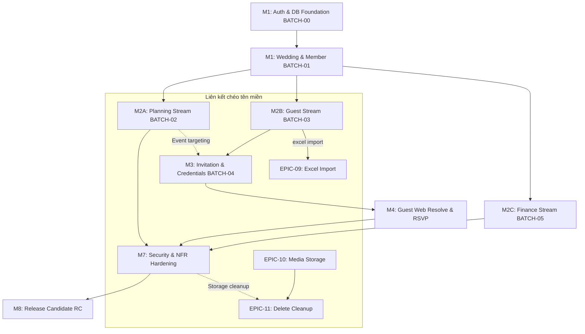

# Kế Hoạch Lập Bản: 11 — Kế Hoạch Triển Khai Thực Thi (Implementation Plan)

*   **Trạng thái (Status):** APPROVED (Đã Phê duyệt)
*   **Người thực hiện:** Antigravity (AI Architect)
*   **Ngày cập nhật:** 21/08/2026

---

> [!IMPORTANT]
> **NON-EXECUTABLE IMPLEMENTATION PLAN**
> Tài liệu này đại diện cho Kế hoạch Triển khai Thực thi (Implementation Plan) phân chia thứ tự di trú cơ sở dữ liệu, thứ tự viết API và phát triển ứng dụng di động/web theo từng Workstream. Tài liệu này không chứa mã nguồn thực thi hay tệp di trú chạy trực tiếp trên database thực tế.

---

## A. Nguyên Tắc Triển Khai (Implementation Principles)

Quy trình phát triển hệ thống tuân thủ chặt chẽ nguyên lý **lát cắt dọc hoàn chỉnh (Vertical Slice)**:
*   Mỗi lát cắt chức năng bắt buộc phải đi từ: **Mô hình dữ liệu vật lý (schema) $\rightarrow$ Các ràng buộc toàn vẹn cơ sở dữ liệu (constraints) $\rightarrow$ Phân quyền Grants/RLS và bảo vệ protected fields $\rightarrow$ Đường truyền API backend (RPC hoặc Edge) $\rightarrow$ Giao diện người dùng di động/web (Flutter/React SPA) $\rightarrow$ Các bộ kiểm thử tích hợp và bảo mật tự động.**
*   Lát cắt hoàn thành khi và chỉ khi đem lại một kết quả nghiệp vụ có thể quan sát, đo lường và kiểm thử thông suốt (observable/testable outcome).

---

## B. Điều Kiện Quyết Định Trước Triển Khai (Pre-Implementation Decision Gate)

### 1. Quyết định nhóm A (Chốt trước migration đầu tiên):
*   **`DEC-A-001` (Kiểu số thực tài chính):** Chốt sử dụng kiểu dữ liệu PostgreSQL **`numeric(15, 2)`** cho toàn bộ các trường số tiền authoritative trên DB, API truyền nhận chuỗi Decimal String dạng `"1500000.00"`.
    *   *Lý do lựa chọn:* `numeric(15, 2)` hỗ trợ giá trị giao dịch lên tới 9.999.999.999.999,99đ, đáp ứng dư dả nhu cầu ngân sách cưới tại Việt Nam, đồng thời loại bỏ hoàn toàn sai số làm tròn số thập phân của float.
*   **`DEC-A-002` (Sơ đồ phân vùng & Chỉ mục):** Chốt không phân vùng bảng dữ liệu chặng MVP để giữ hạ tầng tối giản. Cấu hình chỉ mục index B-Tree cơ bản làm nền tảng trên các cột khóa ngoại. Hệ thống không cấm sử dụng các loại chỉ mục nâng cao khác (như GiST hay GIN) nếu chặng sau phát sinh các truy vấn tìm kiếm/không gian đặc thù cần tối ưu hóa.
*   **`DEC-A-003` (Quyền sở hữu Schema):** Sử dụng vai trò mặc định của Supabase để kiểm soát phân lớp schema.

### 2. Quyết định nhóm B (Chốt trước coding tính năng liên quan):
*   **`DEC-B-001` (Cấu trúc template):** Chốt định dạng file mẫu kế hoạch JSON.
*   **`DEC-B-002` (Độ dài Token thiệp):** Chốt sinh token thô 16 bytes bằng bộ sinh số ngẫu nhiên mật mã (Hex format 32 ký tự).
*   **`DEC-B-003` (Cấu trúc Storage):** Thống nhất format đường dẫn ảnh private.
*   **`DEC-B-004` (Kiểm soát lạm dụng/Rate limit Class D):** Bắt buộc xây dựng cơ chế rate limit chủ động và cấu hình được cho Edge resolve/RSVP Class D. Cơ chế sử dụng network/IP signal kết hợp định danh thiệp đã được xác thực, trả lỗi HTTP 429 `RATE_LIMITED` khi quá ngưỡng, tuyệt đối cấm log token thô. Không được giả định Supabase có sẵn bộ giới hạn mặc định 60/min/IP.
    *   *Quy định phòng chống lạm dụng:* Cấm triển khai các hình thức khóa IP tạm thời (ví dụ: block IP 15 phút) chặng MVP để tránh khóa nhầm người dùng hợp lệ trong mạng dùng chung (NAT/3G/4G).

---

## C. Đồ Thị Phụ Thuộc Triển Khai (Dependency DAG)

Đồ thị thiết lập đúng mối quan hệ phụ thuộc phi tuần tự (tách biệt luồng Finance độc lập khỏi luồng Guest Web/RSVP để có thể phát triển song song):

---

## D. Kế Hoạch Các Đợt Di Trú Cơ Sở Dữ Liệu (Migration Batch Plan)

Các đợt di trú cơ sở dữ liệu sắp xếp tuần tự theo đúng đồ thị DAG phụ thuộc và bảo toàn toàn vẹn khóa ngoại (Foreign Keys):

### BATCH-00: Platform / Database Namespace Foundation (Hạ tầng kỹ thuật nền)
*   **Mục tiêu:** Khai báo cấu hình schema `private`, schema `security`, schema `api_v1`, schema `internal` cùng các extensions yêu cầu (ví dụ: `uuid-ossp`, `pgcrypto`) và các primitives/triggers độc lập không truy vấn bảng nghiệp vụ.
*   **Chính sách:** Khóa toàn bộ quyền truy cập của vai trò public client (`authenticated`, `anon`). Không chứa hàm helper phụ thuộc bảng hay bảng receipt.

### BATCH-01: Wedding & Membership Foundation (Khởi tạo đám cưới)
*   **Bảng nghiệp vụ:** 
    1. `weddings`
    2. `wedding_members`
    3. `pending_collaborator_invitations`
*   **Thiết lập bảng kỹ thuật nội bộ:** Ngay sau khi bảng `weddings` được tạo thành công, tiến hành tạo bảng **`private.trusted_operation_receipts`** đảm bảo ràng buộc khóa ngoại `wedding_id REFERENCES weddings(id) ON DELETE CASCADE`.
*   **Helper Functions & Security:** Tạo các hàm kiểm duyệt phụ thuộc bảng như `security.can_mutate_wedding`, `security.can_owner_delete_wedding`, thiết lập chính sách RLS/Grants và các tiền đề cho lệnh `api_v1.create_wedding`.

### BATCH-02: Events & Tasks Foundation (Kế hoạch cưới)
*   **Bảng nghiệp vụ:**
    4. `wedding_events`
    5. `tasks`
*   **Constraints:** XOR check constraints ngày sự kiện con, composite FK (`wedding_id`, `wedding_event_id`).
*   **RLS & Triggers:** Triggers provenance `task_source` và `is_user_modified` tự động. RLS check can_mutate_wedding.

### BATCH-03: Guest Foundation (Nhóm & Hộ khách)
*   **Bảng nghiệp vụ:**
    10. `primary_groups`
    11. `guests`
    12. `invitation_parties`
*   **Constraints:** Composite FKs cùng `wedding_id`.
*   **RLS & Triggers:** Trigger chuẩn hóa số điện thoại/email thô khi ghi.

### BATCH-04: Invitation & Credentials Foundation (Thiệp mời & RSVP)
*   **Bảng nghiệp vụ:**
    13. `invitations`
    14. `invitation_event_targetings`
    15. `invitation_credentials`
    16. `rsvps`
    17. `event_responses`
*   **Constraints:** Ràng buộc duy nhất token_hash, composite FKs targetings.
*   **RLS & Triggers:** Trigger hủy credential cũ khi tạo credential mới. RLS chặn anon PostgREST.

### BATCH-05: Finance Foundation (Ngân sách & Giao dịch)
*   **Bảng nghiệp vụ:**
    6. `budget_items`
    7. `installments`
    8. `payments`
    9. `refunds`
*   **Views:** View tài chính phái sinh `v_wedding_finance_summary` và dòng tiền `v_wedding_cash_flow_daily`.
*   **RLS & Triggers:** OWNER RLS SELECT/CUD budget & installments. payments/refunds RLS khóa hoàn toàn CUD trực tiếp.

---

## E. Ma Trận Triển Khai 31 Bề Mặt API Ban Tổ Chức (Class C API Surface Matrix)

Dưới đây là sơ đồ đặc tả lộ trình thực thi đầy đủ **31 organizer client-callable surfaces** khớp tuyệt đối với 24 TOP và 1 TRD:

| Surface / DB Function | Transport | Story ID | BATCH Prerequisite | Implementation Milestone | Client Consumer | Test Obligation | Status |
| :--- | :---: | :--- | :---: | :---: | :--- | :--- | :---: |
| `api_v1.create_wedding` | RPC | `STORY-02-01` | `BATCH-01` | `M1` | Flutter | Test trùng `request_id`, test owner gán | `PLANNED` |
| `POST /v1/organizer/weddings/plan` | Edge | `STORY-02-01` | `BATCH-02` | `M2` | Flutter | Test concurrency sinh, check template | `PLANNED` |
| `api_v1.archive_wedding` | RPC | `STORY-11-01` | `BATCH-01` | `M6` | Flutter | Test ghi dữ liệu khi đã Archive | `PLANNED` |
| `POST /v1/organizer/weddings/delete` | Edge | `STORY-11-02` | `BATCH-01` | `M6` | Flutter | Test dọn storage trước, cascade DB | `PLANNED` |
| `api_v1.create_pending_invitation` | RPC | `STORY-04-01` | `BATCH-01` | `M3` | Flutter | Test OWNER access, test email pending | `PLANNED` |
| `api_v1.revoke_pending_invitation` | RPC | `STORY-04-01` | `BATCH-01` | `M3` | Flutter | Test chuyển status sang `REVOKED` | `PLANNED` |
| `api_v1.list_my_pending_invitations` | RPC | `STORY-04-02` | `BATCH-01` | `M3` | Flutter | Test so khớp Google Auth email JWT | `PLANNED` |
| `api_v1.accept_pending_invitation` | RPC | `STORY-04-02` | `BATCH-01` | `M3` | Flutter | Test active member cũ trùng email | `PLANNED` |
| `api_v1.revoke_wedding_member` | RPC | `STORY-04-03` | `BATCH-01` | `M3` | Flutter | Test final OWNER invariant chặn | `PLANNED` |
| `api_v1.change_main_event` | RPC | `STORY-03-01` | `BATCH-02` | `M2` | Flutter | Test update cờ main_event duy nhất | `PLANNED` |
| `api_v1.preview_event_date_change` | RPC | `STORY-03-02` | `BATCH-02` | `M2` | Flutter | Test tính băm impact_fingerprint | `PLANNED` |
| `api_v1.commit_event_date_change` | RPC | `STORY-03-02` | `BATCH-02` | `M2` | Flutter | Test stale-state block, Completed task | `PLANNED` |
| `api_v1.preview_event_removal` | RPC | `STORY-03-02` | `BATCH-02` | `M2` | Flutter | Test tính băm impact_fingerprint | `PLANNED` |
| `api_v1.commit_event_removal` | RPC | `STORY-03-02` | `BATCH-02` | `M2` | Flutter | Test dời task USER lên Wedding-level | `PLANNED` |
| `api_v1.preview_primary_group_delete` | RPC | `STORY-05-01` | `BATCH-03` | `M3` | Flutter | Test tính băm impact_fingerprint | `PLANNED` |
| `api_v1.commit_primary_group_delete` | RPC | `STORY-05-01` | `BATCH-03` | `M3` | Flutter | Test retry khi group đã biến mất | `PLANNED` |
| `api_v1.preview_guest_party_move` | RPC | `STORY-05-01` | `BATCH-03` | `M3` | Flutter | Test tính băm impact_fingerprint | `PLANNED` |
| `api_v1.commit_guest_party_move` | RPC | `STORY-05-01` | `BATCH-03` | `M3` | Flutter | Test retry di chuyển, check invited count| `PLANNED` |
| `api_v1.preview_guest_merge` | RPC | `STORY-05-02` | `BATCH-03` | `M3` | Flutter | Test fingerprint không có tài chính | `PLANNED` |
| `api_v1.commit_guest_merge` | RPC | `STORY-05-02` | `BATCH-03` | `M3` | Flutter | Test retry absent, test STALE/CONFLICT | `PLANNED` |
| `POST /v1/organizer/excel/confirm` | Edge | `STORY-09-01` | `BATCH-03` | `M6` | Flutter | Test parse JSON local, test receipt | `PLANNED` |
| `api_v1.create_payment` | RPC | `STORY-08-02` | `BATCH-05` | `M4` | Flutter | Test receipt, test active/revoked payer | `PLANNED` |
| `api_v1.edit_payment` | RPC | `STORY-08-02` | `BATCH-05` | `M4` | Flutter | Test expected_updated_at concurrency | `PLANNED` |
| `api_v1.void_payment` | RPC | `STORY-08-02` | `BATCH-05` | `M4` | Flutter | Test chuyển status sang VOIDED | `PLANNED` |
| `api_v1.create_refund` | RPC | `STORY-08-02` | `BATCH-05` | `M4` | Flutter | Test receipt, check negative amount block| `PLANNED` |
| `api_v1.edit_refund` | RPC | `STORY-08-02` | `BATCH-05` | `M4` | Flutter | Test expected_updated_at concurrency | `PLANNED` |
| `api_v1.void_refund` | RPC | `STORY-08-02` | `BATCH-05` | `M4` | Flutter | Test chuyển status sang VOIDED | `PLANNED` |
| `api_v1.preview_installment_compound` | RPC | `STORY-08-01` | `BATCH-05` | `M4` | Flutter | Test tính băm impact_fingerprint | `PLANNED` |
| `api_v1.commit_installment_compound` | RPC | `STORY-08-01` | `BATCH-05` | `M4` | Flutter | Test installment thay đổi, check đúp | `PLANNED` |
| `POST /v1/organizer/credentials/regen` | Edge | `STORY-06-01` | `BATCH-04` | `M5` | Flutter | Test token_hash update, test block cũ | `PLANNED` |
| `api_v1.organizer_manual_rsvp` | RPC | `STORY-07-01` | `BATCH-04` | `M5` | Flutter | Test patch-by-event, return derived summary| `PLANNED` |

---

## F. Lát Cắt Viết Code Khuyên Dùng Đầu Tiên (First Vertical Slice)

*   **Luồng thực thi:** Google Sign-In $\rightarrow$ Nhận JWT token $\rightarrow$ Gọi RPC `api_v1.create_wedding` gửi kèm `request_id` sinh ngẫu nhiên ở client $\rightarrow$ DB atomically tạo Wedding và gán user làm OWNER thành viên $\rightarrow$ Flutter nhận diện Wedding context và tự động chọn/render không gian làm việc tương ứng (Home UI).
*   **Điều kiện tiên quyết bắt buộc:**
    *   Cửa quyết định `DEC-A-001` chốt precision `numeric(15,2)`.
    *   Môi trường Supabase container local/staging khởi tạo hoàn chỉnh.
    *   DB Migration Batch 00 (Technical schemas và independent primitives) được chạy thành công.
    *   DB Migration Batch 01 (weddings, wedding_members, pending_collaborator_invitations, private.trusted_operation_receipts và helper functions) được chạy thành công.
*   **Bộ kiểm thử xác minh E2E (Verification obligations):**
    1.  User hợp lệ gửi tạo Wedding thành công $\rightarrow$ DB có bản ghi Wedding và Member OWNER tương ứng trong cùng giao dịch.
    2.  User gửi lại trùng `request_id` $\rightarrow$ Trả về kết quả replay cũ, cấm sinh đám cưới thứ hai.
    3.  User gửi lại trùng `request_id` nhưng sửa thông tin payload $\rightarrow$ Trả lỗi `REQUEST_ID_REUSED` (409).
    4.  User chưa đăng nhập gọi RPC $\rightarrow$ Block lập tức ở lớp API Gateway (401).
    5.  User khác cố truy cập thông tin Wedding vừa tạo $\rightarrow$ RLS chặn đứng.
    6.  Bộ kiểm thử tích hợp (Integration tests) có thể sử dụng và assert chính xác mã `wedding_id` nội bộ được trả về để xác minh tính nguyên thủy.

---

## G. Chiến Lược Kiểm Thử An Ninh & Công Cụ (Security Verification Strategy)

*   **Công cụ thực thi kiểm thử DB:** Sử dụng **`pgTAP`** được quyết định làm thư viện test SQL chính thức mức cơ sở dữ liệu (chạy kiểm thử unit test đối với schema, constraints và RLS).
*   **Ràng buộc điều kiện Release:** 100% các kịch bản kiểm thử bảo mật chéo tenant, phân quyền collaborator block trên tài chính và kiểm thử replay trùng lặp `request_id` bắt buộc phải **pass tuyệt đối**. Không sử dụng chỉ số code coverage phần trăm của client làm thước đo sẵn sàng release nếu các bài test an ninh cốt lõi này bị bỏ qua.
*   **Kiểm thử theo lát cắt dọc:**
    *   *Create Wedding:* Test chèn receipt, replay trùng mã, chặn spam tạo đúp.
    *   *Planning:* Test chèn đầu việc của đám cưới B khi đang đăng nhập JWT đám cưới A $\rightarrow$ Trigger/RLS chặn.
    *   *Finance:* Test tài khoản Collaborator gửi RPC chi tiêu $\rightarrow$ Trả lỗi 403.
    *   *Guest Web:* Test resolved token thiệp cũ đã bị thu hồi $\rightarrow$ Edge Function trả lỗi 404.

---

## H. Cổng Phóng Thích & Nghiệm Thu (Release & Performance Gates)

### 1. Cổng Bảo mật & Riêng tư Thiệp Class D (Invitation Credential Privacy Gate)
Xác minh bắt buộc:
*   Mã token thô tuyệt đối không được ghi nhận trong DB hay log truyền dẫn/telemetry (chỉ lưu token_hash băm SHA-256).
*   Mức digest storage hoạt động chuẩn xác.
*   URL fragment bootstrap và hàm `replaceState` loại bỏ token khỏi địa chỉ trình duyệt chạy đúng chặng Guest Web.
*   `localStorage` không được sử dụng dưới mọi hình thức (chỉ dùng `sessionStorage` cho tab recovery ngắn hạn).
*   Các cuộc gọi Class D trực tiếp vào database qua PostgREST của Supabase bị chặn đứng 100% ở lớp RLS.
*   Token đã bị thu hồi (revoked) hoặc token cũ sau khi thực hiện regeneration bị từ chối truy cập 100%.

### 2. Cổng Nghiệm thu Hiệu năng NFR Targets (Performance Gate)
Đo đạc hiệu năng trên môi trường staging với bộ dữ liệu mẫu định hình trước (300 guests, 500 tasks, 100 payments):
*   *Android list view target:* Thời gian load và render list Tasks di động di động `< 2` giây.
*   *Guest Web 4G load target:* Thời gian load hiển thị thiệp mời trực tuyến từ lúc tải trang `< 3` giây trên mạng 4G profile cố định.
*   *Excel Import target:* Thời gian Edge Function parse JSON lô 300 khách mời và commit DB `< 5` giây.
*   Các chỉ số trên là mục tiêu đo kiểm (targets), không cam kết hoàn tất runtime cho đến khi chạy script đo đạt thực tế.

---

## I. Mốc Triển Khai Kỹ Thuật DAG-Aligned (Implementation Milestones)

*   **`M0`:** Implementation Decision Gate (Quyết định Gate A).
*   **`M1`:** Platform/Auth/Wedding Security Foundation + Lát cắt code khuyên dùng đầu tiên (Batch 00 & Batch 01).
*   **Nhóm Mốc song song M2 (Parallel Stream):**
    *   **`M2A` (Planning Core):** Viết Batch 02 và UI lập kế hoạch đầu việc.
    *   **`M2B` (Guest Core):** Viết Batch 03 và UI Guests, gộp khách, import Excel local.
    *   **`M2C` (Finance Core):** Viết Batch 05 và UI tài chính budgets/installments/payments.
*   **`M3`:** Invitation Credentials & Targetings (BATCH-04 - yêu cầu đầu vào từ Guest Stream).
*   **`M4`:** Guest Web Resolve & RSVP UI (React SPA resolve/rsvp/VietQR + Edge Class D).
*   **`M5`:** Storage & Media Foundation.
*   **`M6`:** Wedding Lifecycle Delete & Storage Cleanup.
*   **`M7`:** Hardening, Security Matrix audit & NFR performance benchmarks.
*   **`M8`:** Release Candidate (RC) smoke testing.

---

## J. Cơ Hội Phát Triển Song Song (Parallelization Plan)

Sau khi hoàn thành mốc **`M1`** (Auth & Wedding Workspace):
1.  **Nhánh 1 (Planning):** Lập trình viên A viết schema Batch 02 và hoàn thiện UI quản lý công việc trên Flutter.
2.  **Nhánh 2 (Guests):** Lập trình viên B viết schema Batch 03 và hoàn thiện UI Guests trên Flutter.
3.  **Nhánh 3 (Finance):** Lập trình viên C viết schema Batch 05 và hoàn thiện UI tài chính trên Flutter.
4.  **Nhánh 4 (Guest Web):** Lập trình viên D khởi dựng khung React SPA tĩnh trên Cloudflare Pages (Guest Web static shell).
*   *Ràng buộc:* Quy trình tích hợp RSVP động chặng sau bắt buộc phải đợi mốc **`M3`** (Invitation Credentials) hoàn tất.

---

## K. Nhật Ký Lỗ Hổng Lập Kế Hoạch (PLAN Gap Register)

*   **`PLAN-GAP-001` (Migration inventory incomplete/inconsistent) $\rightarrow$ RESOLVED.** Đặc tả đầy đủ 17 bảng nghiệp vụ công khai cùng 1 bảng receipt nội bộ.
*   **`PLAN-GAP-002` (Receipt migration ordered after first consumer) $\rightarrow$ RESOLVED.** Đưa bảng `private.trusted_operation_receipts` vào di trú trước khi triển khai các RPC tài chính.
*   **`PLAN-GAP-003` (Trusted surface implementation order partial) $\rightarrow$ RESOLVED.** Lập bản đồ chi tiết 1-1 cho toàn bộ **31 surfaces** gọi công khai của ban tổ chức.
*   **`PLAN-GAP-004` (Dependency DAG serialized independent Finance work) $\rightarrow$ RESOLVED.** Tách nhánh Finance độc lập khởi chạy song song với luồng Guest Web/RSVP.
*   **`PLAN-CONFLICT-001` (Assumed default rate limit) $\rightarrow$ RESOLVED.** Khước từ giả định rate limit mặc định của Supabase. Chốt cơ chế rate limit chủ động.
*   **`PLAN-CONFLICT-002` (Story inventory/count mismatch) $\rightarrow$ RESOLVED.** Đối soát và chuẩn hóa danh mục **25 Stories** trong backlog MVP.
*   **`PLAN-GAP-005` (Business-dependent technical objects scheduled before their table dependencies) $\rightarrow$ RESOLVED.** Di dời `private.trusted_operation_receipts` sang BATCH-01 khởi tạo ngay sau khi có bảng `weddings` để bảo toàn khóa ngoại vật lý.

---

## L. Câu Hỏi Mở Về Triển Khai (Remaining Open Questions)

*   *Không còn câu hỏi mở nào chặng lập kế hoạch. Tất cả các rào cản IP block và rate limiting Class D đã được giải quyết ở quyết định `DEC-B-004`.*
